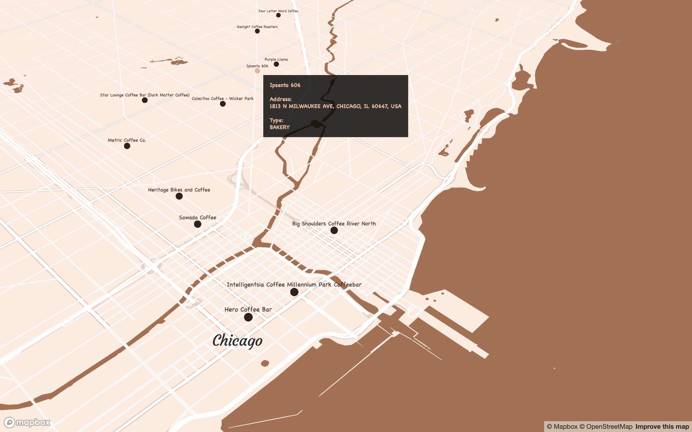

<a id="top"></a>

******      

<!--    -->
  
<!-- ******   -->

<br>  

What's the [#30DayMapChallenge](https://github.com/tjukanovt/30DayMapChallenge)? It's an annual mapping challenge for the month of November where anyone can partake by posting a creation in the spatial world. Here's the official tag taken from the website.    

> A daily mapping/cartography/data visualization challenge aimed at the spatial community  

The rules are pretty simple: create a map or spatial-related output using any means, as long as it's your own work and that you credit data sources. As I mostly use `R`, this is my bread and butter for this challenge. 

This year I'm challenging myself by using a new tool, software, design, or data source for each entry. I just have to learn something new each time, rather than recycle familiar tools.  Creating 30 new maps in 30 days is tough, so I think half of this is a decent target.     

    
  

<br>  
<a id="day1"></a>  
[](#day1)  
# Day 1: Points          

### Mapping my favourite coffee places around the world    

An interactive map of my favourite coffee spots around the world (so far) using Mapbox and `mapdeck` in `R`.     

Part of a larger project where I'm mapping my favourite food places around the world to create a centralised repository so I can more easily address the following conversation:      

> Friend: 'Do you know any good _INSERT FOOD_ places in _INSERT CITY_?'          
> Me: 'Sure thing, I collated all my favourite places and put it all in this site. Enjoy.'                  

Not an exhaustive list of places and updated regularly as I find them. The total list of places for the overall project is close to 100 spanning different categories and the code is automated to pull the data with new updates.

### Process    
* Data were georeferenced from mobile location data using Open Street Map   
* Mapped with `mapdeck` in `R`  
* Map design from Mapbox Studio                         

### [Click for full map](https://darwinanddavis.github.io/worldmaps/30daymap2020/day1)   
(Best viewed in Safari and full screen)            
  
   

### Tools  

R  
Mapbox        
```{r}    
pacman::p_load(here,sf,RColorBrewer,dplyr,ggmap,sp,maptools,scales,rgdal,ggplot2,jsonlite,readr,devtools,colorspace,mapdata,ggsn,mapview,mapproj,ggthemes,reshape2,grid,rnaturalearth,rnaturalearthdata,ggtext,purrr)          
```  
 

### Links      
[`R` code](https://github.com/darwinanddavis/worldmaps/tree/gh-pages/docs/30daymap2020)        

******  


<br>  
<a id="day2"></a>    
[](#day2)  
# Day 2: Lines      

### Roadtrippin' the US     

My parents visited the US/me when I was living in ATL. They roadtripped the south, starting in Austin. I met them in Memphis, then drove to ATL. This map is using geolocation data to track their pathway across the US with `R` and Mapbox.        

Data were georeferenced from mobile location data using Open Street Map. Pathways were mapped from KML data. Polygon data were retrieved from Natural Earth Map data.  

<br> 

   

### Tools  

R      
```{r}  
pacman::p_load(here,sf,RColorBrewer,dplyr,ggmap,sp,maptools,scales,rgdal,ggplot2,jsonlite,readr,devtools,colorspace,mapdata,ggsn,mapview,mapproj,ggthemes,reshape2,grid,rnaturalearth,rnaturalearthdata,ggtext,purrr)          
```  
  

******  

<!-- <br>
# Day 3: Polygons

******   -->

<br>
<a id="day4"></a>  
[](#day4)  
# Day 4: Hexagons

### Mapping my Lyft ride activity over two years    

Using geolocation data for my Lyft rides as a passenger to build an interactive map that shows my Lyft activity, including origin pickup and destination dropoff points. The data covers the USA.  

These data are really cool, so I just wanted to make use of them. Hexagons are good for visualising frequency and mobility spatial data. My data here ended up being too coarse (obviously I didn't take enough Lyft rides) to leverage this, but it tells a story about where my ride activity is weighted. There is also a time component, which I'll definitely use for another analysis.                 

### Notes   
* Data were obtained from my Lyft ride report.    
* Data were first georeferenced to get latlons.     
* Zoom out to see the cities where I used Lyft to get around. Cities with labels contain data, sometimes only a few points. 
* Note the legend in the below images in case the legend in the link is chopped off.            

### Limitations  
* Hexagons are good for large scale coarse and clustered data, like heatmaps. The data here are too sparse to make full use of this.  
* There is a higher density of destination sites because I primarily used Lyft to get home, which is concentrated on one latlon point. 
* Georeferencing the data didn't find all locations, so some points are missing.            

### [Click for full map](https://darwinanddavis.github.io/worldmaps/30daymap2020/day4)        
(Best viewed in Safari and full screen)        

Atlanta, USA (where I lived during this time)      
 
<br>

Washington DC, USA     
 
<br>  

St Louis, USA  
 
<br>  

Chicago, USA  
 
<br>  


### Tools     
  
R    
Mapbox           
```{r}  
pacman::p_load(mapdeck,readr,ggmap,dplyr,sf,sfheaders,data.table,tigris,sp,maps,colorspace)  
```  
              
### Links      
[`R` code](https://github.com/darwinanddavis/worldmaps/tree/gh-pages/docs/30daymap2020)    

******  

<br>
<a id="day6"></a>  
[](#day6)  
# Day 6: Red  

### Cinnamon squirrel locations in NYC Central Park  

Squirrels! The NYC Open Data Squirrel Census on squirrel sightings. I've seen these data used many times and I hadn't tried them yet. There are detailed behaviour data too, but location data are fine for this exercise.       

The fur colour is defined as cinnamon. I'm no squirrel expert, but I've seen these squirrels in person/in squirrel and they look pretty red to me. There are probably species differences between the cinnamon and red varieties. I don't even like cinnamon.    


Press the down arrow or use the up/down webpage scroll bar if the legend is chopped off.    


### [Click for full map](https://darwinanddavis.github.io/worldmaps/30daymap2020/day6)      
(Best viewed in Safari and full screen)      
  
 
<br>
  
### Tools     
  
R             
Mapbox    
```{r}  
pacman::p_load(here,mapdeck,dplyr,purrr,readr)    
```    
 
### Links      
[`R` code](https://github.com/darwinanddavis/worldmaps/tree/gh-pages/docs/30daymap2020)  
[OpenData NYC squirrel census](https://data.cityofnewyork.us/Environment/2018-Central-Park-Squirrel-Census-Squirrel-Data/vfnx-vebw)       

******  

<br>
<a id="day8"></a>  
[](#day8)  
# Day 8: Yellow  

### Australia's global honey export trade       

Mapping Australia's honey exports from some publicly available trade data for 2017. Australia is in the top five major exporters for honey.  

The data go as far back as the 1960s. However, a time series component seemed like overkill for this particular exercise.             

### [Click for full map](https://darwinanddavis.github.io/worldmaps/30daymap2020/day8)      
  
   
<br>
  
### Tools     
  
R    
Leaflet                 
```{r}    
pacman::p_load(here,dplyr,rworldmap,leaflet,readr,rgeos,purrr,stringr,ggthemes,showtext,geosphere,htmlwidgets)
```  

### Links      
[`R` code](https://github.com/darwinanddavis/worldmaps/tree/gh-pages/docs/30daymap2020)      
[BACI International Trade Database](https://legacy.oec.world/en/resources/data/)         

******  


<br>
<a id="day9"></a>  
[](#day9)  
# Day 9: Monochrome   

### Exploring the Appalachian Trail    

Exploring digital elevation models (DEM) of the Appalachian Trail, USA, with the parts along the range where I've visited for either camping or hiking during 2018–2020.    

This was more of a sandbox session in colour palettes and rasters to bring out some of the super intricate detail of terrain models, as well as improving my text and label positioning in `R`. Thanks, `ggtext`.          
  
           
  
### Tools     
  
R             
```{r}    
pacman::p_load(dplyr,readr,rvest,xml2,magrittr,ggplot2,stringr,ggthemes,ggnetwork,elevatr,raster,colorspace,ggtext,ggsn,ggspatial)
```  
    
### Links            
[`R` code](https://github.com/darwinanddavis/worldmaps/tree/gh-pages/docs/30daymap2020)        

### Data    
Terrain raster 3DEP data courtesy of the U.S. Geological Survey      
Terrain tiles obtained from [Amazon Web Services](https://registry.opendata.aws/terrain-tiles/)    

******  


<br>
<a id="day10"></a>  
[](#day10)  
# Day 10: Grid    

### Melbourne's city footprint    

A minimal map design showcasing the classic grid structure of my home city, Melbourne, Australia. There are tonnes of detailed data on the [City of Melbourne Open Data portal](https://data.melbourne.vic.gov.au/) that I may dive into for some future analyses.  

For this challenge, I wanted to make a minimal sketch design map that plays on angles and grid structure. Also, test my label positioning skills using `ggtext`.             
  
           
  
### Tools     
  
R             
```{r}    
pacman::p_load(dplyr,readr,rvest,xml2,magrittr,ggplot2,stringr,ggthemes,ggnetwork,elevatr,raster,colorspace,ggtext,ggsn,ggspatial)
```  
    
### Links            
[`R` code](https://github.com/darwinanddavis/worldmaps/tree/gh-pages/docs/30daymap2020)        


### Data      
[City of Melbourne Open Data](https://data.melbourne.vic.gov.au/)    


****** 

<br>
<a id="day11"></a>  
[](#day11)  
# Day 11: 3D

### The vulnerability of Melbourne's urban forest    

I found some comprehensive data on tree canopy coverage in Melbourne from 2019 on the [City of Melbourne Open Data](https://data.melbourne.vic.gov.au/) site and tree traits are always fun to plot in 3D.  

The data cover species, genera, height (DBH), life expectancy, latlons, year and date planted, precinct location, to name a few. I plotted tree locations and height to show some spatial patterns, e.g. you can see where tall trees have been cleared in areas that are known to have high rise apartments buildings. I added life expectancy as the colour factor to get a snapshot idea of planting activity by the city council and choice of species over time. Lots more to explore.

Some interesting things to explore:      
* How often do invulnerable species need to be re-planted?    
* What kinds of vegetation remains by 2050 if nothing new is planted?       
* What species are least vulnerable to attack (disease, climate, pollution) and are these species prioritised in future urban planning?     
<br>  

Zoom and tilt (hold CMD/CTRL) around the map to explore hotspots for given trees based on height and age. Press the down arrow or use the up/down webpage scroll bar if the legend is chopped off.        

### [Click for full map](https://darwinanddavis.github.io/worldmaps/30daymap2020/day11)  
(Best viewed in Safari and full screen)     
     
             
<br>  

### Snapshot analysis     

SW of city, facing NE. The Central Business District (CBD, centre grid), showing low canopy and short-lived vegetation. The central downtown probably aims for seasonal, high turnover species to match the rapid development pace of the area. 

   
<br>

West of city, facing SE. Low canopy or young long-lived species lining the Docklands, the major port area of the city, which also has high-rise apartment buildings.     

   
<br>

North of city, facing SSE. Royal Park remains open and free of tall species. The larger, open green space is Melbourne Zoo and the National State and Hocket Centre. The bottom right pocket dominated by low canopy or young long-lived species may be due to the type of soil or bedrock adjacent to Moonee Ponds Creek.   

   
<br>

North of city, facing south (aerial view). Tree density and location hugs Melbourne's city grid structure.   

       
<br>  

NE of city, facing south. The highest density of the tallest (diameter at breast height, DBH) trees in the city. The large, open green spaces to the left is Melbourne/Olympic Park, Yarra Park, and AAMI Park, which house the five major state sports ovals.        

       
<br>  
  
### Tools     
  
R             
Mapbox  
```{r}    
pacman::p_load(here,mapdeck,dplyr,purrr,readr,showtext,stringr,colorspace,htmltools)  
```  
    
### Links            
[`R` code](https://github.com/darwinanddavis/worldmaps/tree/gh-pages/docs/30daymap2020)        


### Data      
[City of Melbourne Open Data](https://data.melbourne.vic.gov.au/)    
  
****** 


<br>
<br> 

[Back to top](#top)|[Home page](./index.md)

