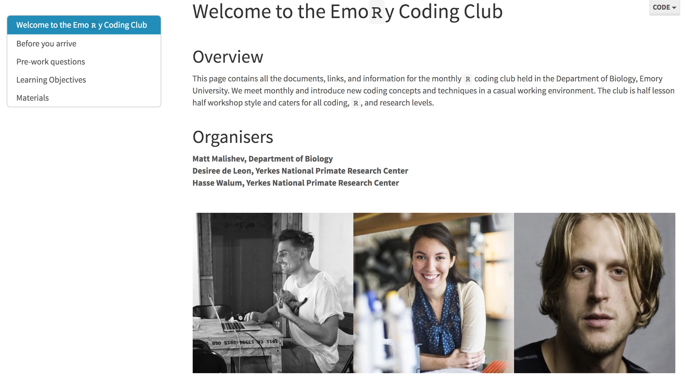
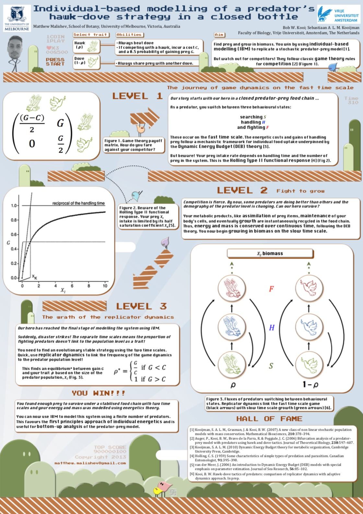

******    

  
  
******    
  
 
## R Coding Club for teaching coding, data analysis, and research tools    

### Location  

Emory University  
Atlanta, USA  

### People  

**Matt Malishev, Emory University, USA**    
Desiree de Leon, Emory University, USA    
Hasse Walum, Emory University, USA    

### Tasks   

* Developed and maintained a regular coding club in coding, research tools, and data analysis in `R`  
* Developed take-home, reproducible coding modules for unsupervised learning        

### Outcomes    

* Monthly coding club in `R` at Emory University
* Teaching and mentoring from undergraduate to professor levels        

### Example outputs  

Head directly to the Emory Coding Club website to see all info on session material and lesson modules.  

## [R Coding Club website](https://darwinanddavis.github.io/EmoRyCodingClub/index.html)    
   

******      
  
 
## Individual-based model of closed predator-prey system using game theory rules with full energy and mass conservation       

### Location  

Vrije Universiteit    
Amsterdam, The Netherlands       

### People

**Matt Malishev, Centre of Excellence for Biosecurity Risk Analysis, Australia**    
Bob W. Kooi, Vrije Universiteit, Amsterdam, The Netherlands  
Sebastiaan A.L.M. Kooijman, Vrije Universiteit, Amsterdam, The Netherlands    

### Tasks   

* Developed a metabolic theory-driven individual-based model for hawk (predator) and dove (prey) game theory dynamics in a stochastic predator-prey model. The model integrates individual-level bioenergetics of each trophic level with full energy and mass conservation, i.e. a closed system.       
* Used replicator dynamics to link behavioural states among individuals in the payoff matrix (fast time scale) and an evolutionary stable strategy at the population and community levels (slow time scale).        

### Outcomes  

**Select trait**  

Hawk (p)  
Dove (1 – p)  

**Abilities**  

Dove        
Always share prey with another dove.  

Hawk  
Always beat dove  

If competing with a hawk, you incur a cost, C, and a 0.5 probability of gaining prey, G.  

**Controls on the fast time scale**  

Searching  
Handling  
Fighting  

**Malishev M**, Kooi BW & Kooijman SALM (2013) Individual-based modelling of a predator’s hawk-dove strategy in a closed bottle (poster), EcoTas13, Auckland, New Zealand          

    

      

    

### References  
  
Kooijman, S. A. L. M., Grasman, J. & Kooi, B. W. (2007) A new class of non linear stochastic population models with mass conservation. _Mathematical Biosciences_, 210:378–394.        

Auger P, Kooi BW, Bravo de la Parra, R & Poggiale, JC (2006) Bifurcation analysis of a predator- prey model with predators using hawk and dove tactics. _Journal of Theoretical Biology_, 238:597–607.          

Kooijman, SALM (2010) Dynamic Energy Budget theory for metabolic organization, Cambridge University Press, Cambridge.      

Holling, CS (1959) Some characteristics of simple types of predation and parasitism. _Canadian Entomologist_, 91:395–398.            

van der Meer, J (2006) An introduction to Dynamic Energy Budget (DEB) models with special emphasis on parameter estimation. _Journal of Sea Research_, 56:85–102.       

Kooi, BW (2015) Modelling the dynamics of traits involved in fighting-predators–prey system, _Journal of Mathematical Biology_, 71: 1575–1605.      
  

[Download the full poster (`MalishevKooiKooijman_EcoTas13_poster.pdf`).](https://github.com/darwinanddavis/HawkDove/blob/master/MalishevKooiKooijman_EcoTas13_poster.pdf)      

   
   

###### Header image: Taking advantage of open source data to understand plot mechanics in R.      
******  

[Back to top](#top)|[Home page](./index.md)
