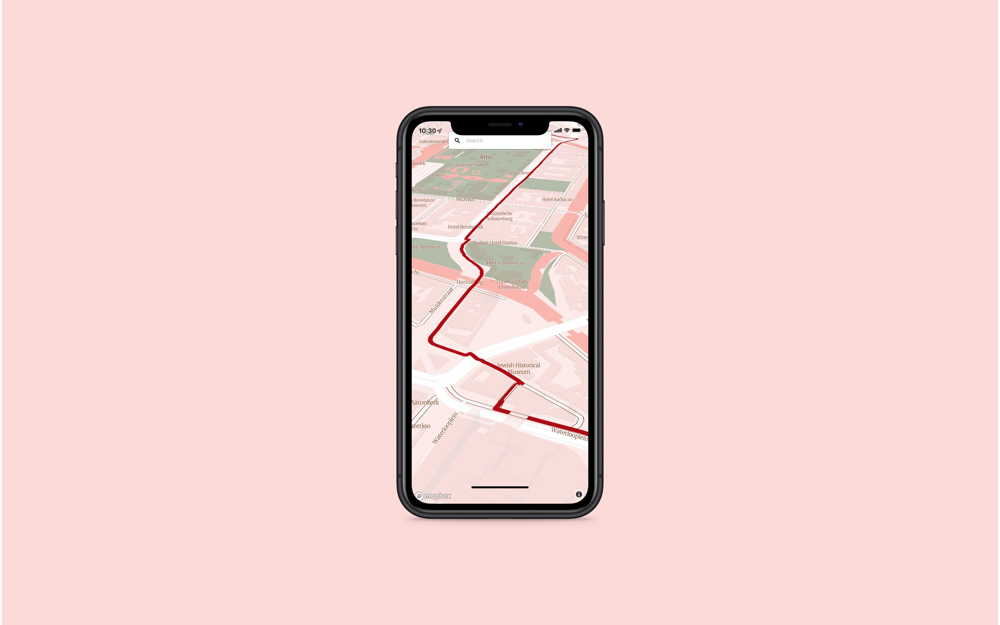
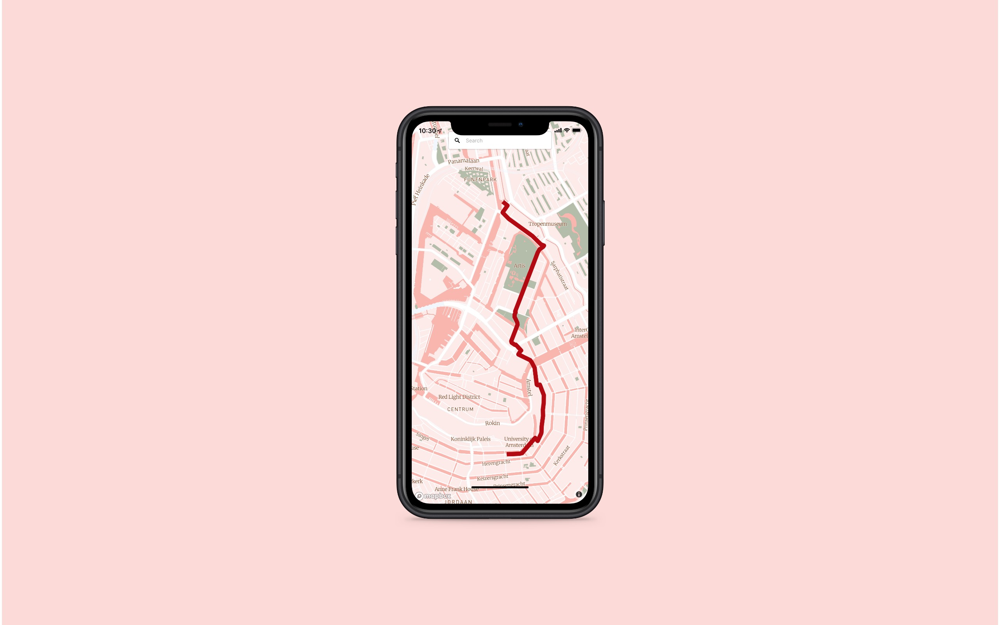
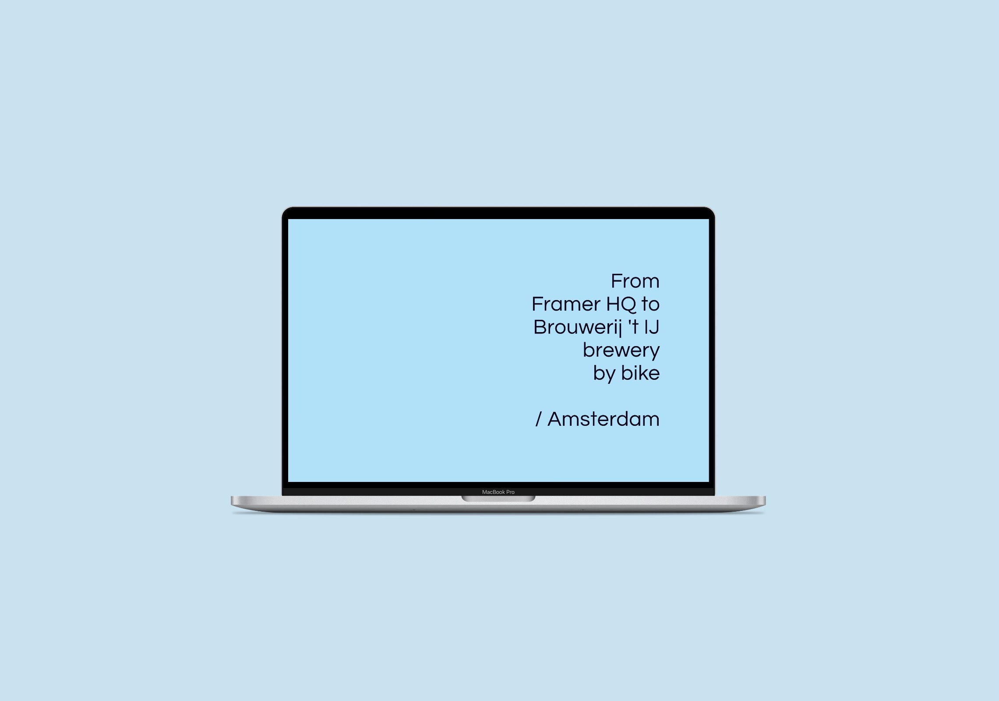
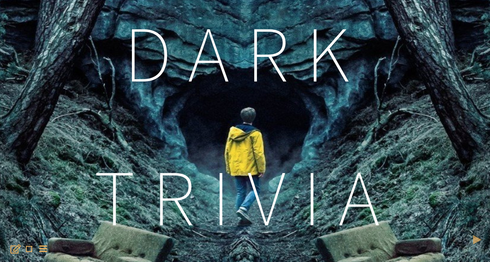

******    

  

******  

 
## Prototyping with Framer using Mapbox APIs      

### Location  

Melbourne, Australia  

### People  

Matt Malishev  

### Tasks    

* Build a geolocation mapping prototype in Framer for a mobile device  
* Use Mapbox APIs to link data, tilesets, and styles from Mapbox Studio for the design              

### Outcomes  

I've been meaning to dive into Framer ever since I watched a webinar a few months ago. It's really fun and intuitive. You can integrate Mapbox's features and preload data using imported tilesets, then prototype the interface in Framer.

As a toy project, here are biking directions from Framer HQ (I think) in Amsterdam to my favourite brewery Brouwerij 't IJ.        

### [Click for interactive mobile prototype](https://framer.com/share/day26--gX1W1or5rDdqG3Rm93n2/ajGqv8pI7?fullscreen=1)       
     
                 
   

If you're unfamiliar with Framer, it's a prototyping tool. Tons of features, interactions, device platforms, graphics, and icon sets.   

Here's the process for this project.      

* Import the geolocation KML data and create a tileset in Mapbox Studio  
* Design the map in Mapbox Studio  
* In Framer, link the Mapbox API and apply features from the Mapbox components package, such as `SequentialLocationMap`   
* Design the interface, including layout, buttons, transitions, icons, and colour palettes, in Framer using any device/media interface as a template      
* Share the project with collaborators    

### Mobile

One cool aspect is you can open the prototype on your own mobile and use regular gestures to navigate the interface.    
             
   

             
   

             
   

             
   

From here, it's pretty simple to switch to different device skins, as well as integrate a newly created design and palette from Mapbox Studio.    

              
   
  
### Tools     
  
Framer  
Mapbox    
    
### Links            
[Framer](https://www.framer.com/)            

******  
  
 
## Interactive trivia site for the Netflix series DARK       

### Location  

Melbourne, Australia  

### People  

**Matt Malishev**  
Nicole Malishev  

### Tasks    

* Make an online and interactive trivia quiz for the Netflix series DARK    

### Outcomes  

A trivia quiz spanning all three seasons of the [Netflix series Dark](https://www.netflix.com/title/80100172). The idea first started as a piece of paper job to test one of our brothers and his friends. Since they were taking it remotely online, we decided to make it into a website.  

My sister Nic and I devised the questions, while she came up with the design and I coded it.     

#### WARNING: Spoiler alert    

If you haven't yet seen the series, I highly recommend it.        

## [Take the DARK trivia](https://darwinanddavis.github.io/misc/dark)       

  

******    
  
 
## R Coding Club for teaching coding, data analysis, and research tools    

### Location  

Emory University  
Atlanta, USA  

### People  

**Matt Malishev, Emory University, USA**    
Desiree de Leon, Emory University, USA    
Hasse Walum, Emory University, USA    

### Tasks   

* Developed and maintained a regular coding club in coding, research tools, and data analysis in `R`  
* Developed take-home, reproducible coding modules for unsupervised learning        

### Outcomes    

* Monthly coding club in `R` at Emory University
* Teaching and mentoring from undergraduate to professor levels        

### Example outputs  

Head directly to the Emory Coding Club website to see all info on session material and lesson modules.  

## [R Coding Club website](https://darwinanddavis.github.io/EmoRyCodingClub/index.html)    
   

******      
  
 
## Individual-based model of closed predator-prey system using game theory rules with full energy and mass conservation       

### Location  

Vrije Universiteit    
Amsterdam, The Netherlands       

### People

**Matt Malishev, Centre of Excellence for Biosecurity Risk Analysis, Australia**    
Bob W. Kooi, Vrije Universiteit, Amsterdam, The Netherlands  
Sebastiaan A.L.M. Kooijman, Vrije Universiteit, Amsterdam, The Netherlands    

### Tasks   

* Developed a metabolic theory-driven individual-based model for hawk (predator) and dove (prey) game theory dynamics in a stochastic predator-prey model. The model integrates individual-level bioenergetics of each trophic level with full energy and mass conservation, i.e. a closed system.       
* Used replicator dynamics to link behavioural states among individuals in the payoff matrix (fast time scale) and an evolutionary stable strategy at the population and community levels (slow time scale).        
  
**Select trait**  

Hawk (p)  
Dove (1 – p)  

**Abilities**  

Dove        
Always share prey with another dove.  

Hawk  
Always beat dove  

If competing with a hawk, you incur a cost, C, and a 0.5 probability of gaining prey, G.  

**Controls on the fast time scale**  

Searching  
Handling  
Fighting   

### Outcomes   

* **Malishev M**, Kooi BW & Kooijman SALM (2013) Individual-based modelling of a predator’s hawk-dove strategy in a closed bottle (poster), EcoTas13, Auckland, New Zealand          

    

      

    

### References  
  
Kooijman, S. A. L. M., Grasman, J. & Kooi, B. W. (2007) A new class of non linear stochastic population models with mass conservation. _Mathematical Biosciences_, 210:378–394.        

Auger P, Kooi BW, Bravo de la Parra, R & Poggiale, JC (2006) Bifurcation analysis of a predator- prey model with predators using hawk and dove tactics. _Journal of Theoretical Biology_, 238:597–607.          

Kooijman, SALM (2010) Dynamic Energy Budget theory for metabolic organization, Cambridge University Press, Cambridge.      

Holling, CS (1959) Some characteristics of simple types of predation and parasitism. _Canadian Entomologist_, 91:395–398.            

van der Meer, J (2006) An introduction to Dynamic Energy Budget (DEB) models with special emphasis on parameter estimation. _Journal of Sea Research_, 56:85–102.       

Kooi, BW (2015) Modelling the dynamics of traits involved in fighting-predators–prey system, _Journal of Mathematical Biology_, 71: 1575–1605.      
  

[Download the full poster (`MalishevKooiKooijman_EcoTas13_poster.pdf`).](https://github.com/darwinanddavis/HawkDove/blob/master/MalishevKooiKooijman_EcoTas13_poster.pdf)      

   
   

###### Header image: Taking advantage of open source data to understand plot mechanics in R.      
******  

[Back to top](#top)|[Home page](./index.md)
