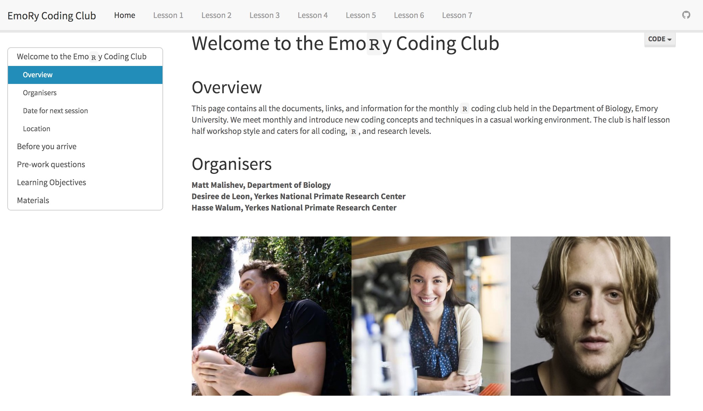

******  

 
## Emory Coding Club for teaching coding, data analysis, and research tools  

### Location  

Emory University  
Atlanta, USA  

### People  

**Matt Malishev, Emory University, USA**    
Desiree de Leon, Emory University, USA    
Hasse Walum, Emory University, USA  

### Tasks   

* Developed and maintained a regular coding club in coding, research tools, and data analysis in `R`  
* Developed take-home, reproducible coding modules for unsupervised learning        

### Outcomes    

* Monthly coding club in `R` at Emory University
* Teaching and mentoring from undergraduate to professor levels        

### Example outputs  

Head directly to the Emory Coding Club website to see all info on session material and lesson modules.  

## [Emory Coding Club website](https://darwinanddavis.github.io/EmoRyCodingClub/index.html)    
   

  
   
   

###### Header image: Taking advantage of open source data to understand plot mechanics in `R`.      
******  

[Back to top](#top)|[Home page](./index.md)
