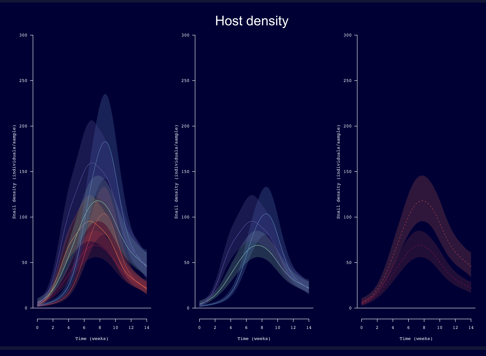
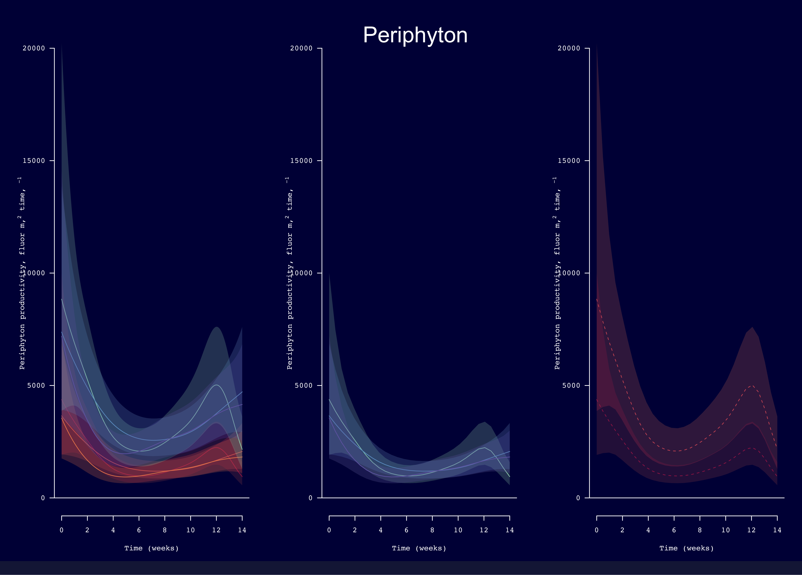

******      

  

******  
  
   
## Forecasting exposure risk in the human schistosome from bioenergetic and disease transmission models     

### Location

Emory University  
Atlanta, USA

### People

**Matt Malishev, Emory University, USA**  
David Civitello, Emory University, USA    

### Tasks

* Built a between-host transmission model and a within-host bioenergetics model of host-parasite infection in the human schistosome to forecast human exposure risk for schistosomiasis.    
* Simulated the consequences of applying chemical control strategies (molluscicides) that vary in frequency and intensity for mediating human-infectious parasite output throughout the transmission season.    

### Outcomes
  
* **Malishev M** & Civitello DJ. Modelling how resource competition among snail hosts affects the mollusciciding frequency and intensity needed to control human schistosomes. _Functional Ecology,_ 34(8): 1678–1689. [https://doi.org/10.1111/1365-2435.13602](https://besjournals.onlinelibrary.wiley.com/doi/abs/10.1111/1365-2435.13602).            
    
* **Malishev M** & Civitello DJ (2019) Linking bioenergetics and parasite transmission models suggests mismatch between snail host density and production of human schistosomes. Integrative and Comparative Biology, 59(5): 1243–1252. [https://doi.org/10.1093/icb/icz058](https://academic.oup.com/icb/advance-article-abstract/doi/10.1093/icb/icz058/5497795?redirectedFrom=fulltext).    

* **Malishev M** and Civitello DJ (2019) Fewer, fatter snail hosts make more human schistosome parasites than many, starved ones, [International Society for Ecological Modelling 2019](https://www.elsevier.com/events/conferences/international-society-for-ecological-modelling-global-conference/programme), ISEM2019, Oct 1–5, Salzburg, Austria.      

* **Malishev M** & Civitello DJ (2019) Simulating parasite emergence from host energetics to inform control strategies of the human schistosome, invited talk, Center for Disease Control and Prevention, USA    

* **Malishev M** & Civitello DJ (2019) Simulating the bioenergetics of snail host infection to predict parasite emergence in the human schistosome, invited talk, Clayton State University, USA         

### Example outputs  
 

 
###### Figure 1. Cumulative human-infectious parasite output (# 500 L–1 ± SE) for A) logistically growing periphyton algae and B) constant detritus subsidy after the seven simulated chemotherapy programs (n = 5) for schistosomiasis control at 95% host mortality (hb = 3.0 d–1) showing potential program success (left of dashed line, in blue) and failure (right of dashed line, in red): no control, one-off control every tenth day (day 10–140), monthly, bimonthly (every two months), skipping day 30, skipping day 60, skipping day 90, and skipping day 120. Resource growth rates are r = 0.25 d-1 and det = 0.25 mg C d-1 for algae and detritus, respectively. Ref: Malishev & Civitello. In review.   
 

###### Figure 2. Human-infectious parasite output (# 500 L–1) for A) logistically growing periphyton algae and B) constant detritus subsidy over the 150-day transmission season for no control, 50%, 75%, 90%, 95%, and 99% host mortality (implemented as an event-based change in the baseline mortality hazard rate, hb = 0.69, 1.39, 2.3, 3.0, and 4.6 d–1, respectively) from chemotherapy after control on day 30 only, bimonthly (every two months, day 60 and day 120), and monthly (WHO recommendation). Lighter color areas represent higher parasite densities. Early chemotherapy (day 30 only) results in severe rebounds late season unless host mortality is 99%. Compared to scenarios with algae, detritus scenarios with no control produces extended parasite outputs and thus shows prolonged, exaggerated rebounds late in the season after a ‘risky’ chemotherapy event (< 99% intensity and for early and intense chemotherapy, i.e. day 30 only). Similarly, bimonthly generates bimodal peaks from prolonged parasite output. Resource growth rates are r = 0.25 d-1 and det = 0.25 mg C d-1 for algae and detritus, respectively. Ref: Malishev & Civitello. In review.      
 

###### Figure 3. Human-infectious parasite output (# 500 L–1) for A) logistically growing periphyton algae and B) constant detritus subsidy over a 150-day transmission season for no control, 50%, 75%, 90%, 95%, and 99% host mortality (hb = 0.69, 1.39, 2.3, 3.0, and 4.6 d–1, respectively) from chemotherapy after control when skipping day 30, day 60, day 90, and day 120. Lighter color areas represent higher parasite densities. Weaker control performs worse by stimulating parasite rebounds following the skipped chemotherapy event. Skipping the first month (day 30) acts similarly to monthly control, while skipping day 60 fails to suppress the primary parasite peak normally seen under no control conditions. Detritus scenarios show characteristic prolonged parasite resurgence that is particularly evident when skipping the first month (day 30) irrespective of control intensity. Resource growth rates are r = 0.25 d-1 and det = 0.25 mg C d-1 for algae and detritus, respectively. Ref: Malishev & Civitello. In review.  
 

******  
  
   
## Generalised additive mixed model (GAMM) analysis: mesocosm case study           

Generalised additive mixed model (GAMM) analysis of infected _Biomphalaria_ hosts, periphyton productivity, and nutrient input to test if nutrient enhancement stimulates resources (periphyton productivity) and thus larger infected host abundance and parasite output rates over time.      

     
###### Figure 4. Distribution of _Biomphalaria_ host size over time (14 weeks) from a mesocosm experiment.    
  
Notes:    
- Host size is an ordered factor and nutrient enrichment is a binary predictor.      
- Nutrient enrichment creates larger peaks in infected host density.      
- GAMM reference curves use most robust data; however, the curve with the best fit will be most rigid and thus constrain the flexibility of the other curves.      
- Constant removed to remove linear multiplier to smooths and rescale response variable to reflect actual counts (y-axis). Smooths are rescaled to reflect measured infected host density, not reference curve.          

Error distribution decisions    
1. Biomass densities and periphyton productivity are lognormal.      
2. Host and parasite density are quasipoisson.      

Larger initial host populations lead to higher, slightly earlier peaks.      
Nutrient enrichment increases biomass density peaks.  
  
    
###### Figure 5. Generalised additive mixed model (GAMM) curves for interaction among infected host density, host size, and high nutrient input rates (left), infected host size (middle), and nutrient input (right). Distribution for predicting curves in GAMM is quasipoisson.   
  
    
###### Figure 6. Generalised additive mixed model (GAMM) curves for interaction among periphyton productivity (fluorescence m2 t–1), host size, and high nutrient input rates (left), infected host size (middle), and nutrient input (right). Distribution for predicting curves in GAMM is gaussian.       

Data from Rohr JR, Civitello DJ, Crumrine PW, Halstead NT, Miller AD, Schotthoefer AM, Stenoien C, Johnson LB & Beasley Vl (2015)Predator diversity, intraguild predation, and indirect effects drive parasite transmission, PNAS, 112(10)3008–3013. [doi:https://doi.org/10.1073/pnas.1415971112](https://doi.org/10.1073/pnas.1415971112).     

   

******      
  
 

### Links      

[Project page on Github.](https://github.com/darwinanddavis/SchistoIBM)  

[Supplementary Material for Malishev M & Civitello DJ (2020) Func. Eco., 34(8): 1678–1689.](https://github.com/darwinanddavis/MalishevCivitello_hostcontrol)            

[Supplementary Material for Malishev M & Civitello DJ (2019) Int. Comparat. Biol., 59(5): 1243–1252.](https://github.com/darwinanddavis/MalishevCivitello_SICB)        

   
   

###### Header image: Dynamic energy budget growth equation for tracking changes in structural length of individual _Biomphalaria_ hosts over time (Malishev and Civitello 2019).     
******  

[Back to top](#top)|[Home page](./index.md)

