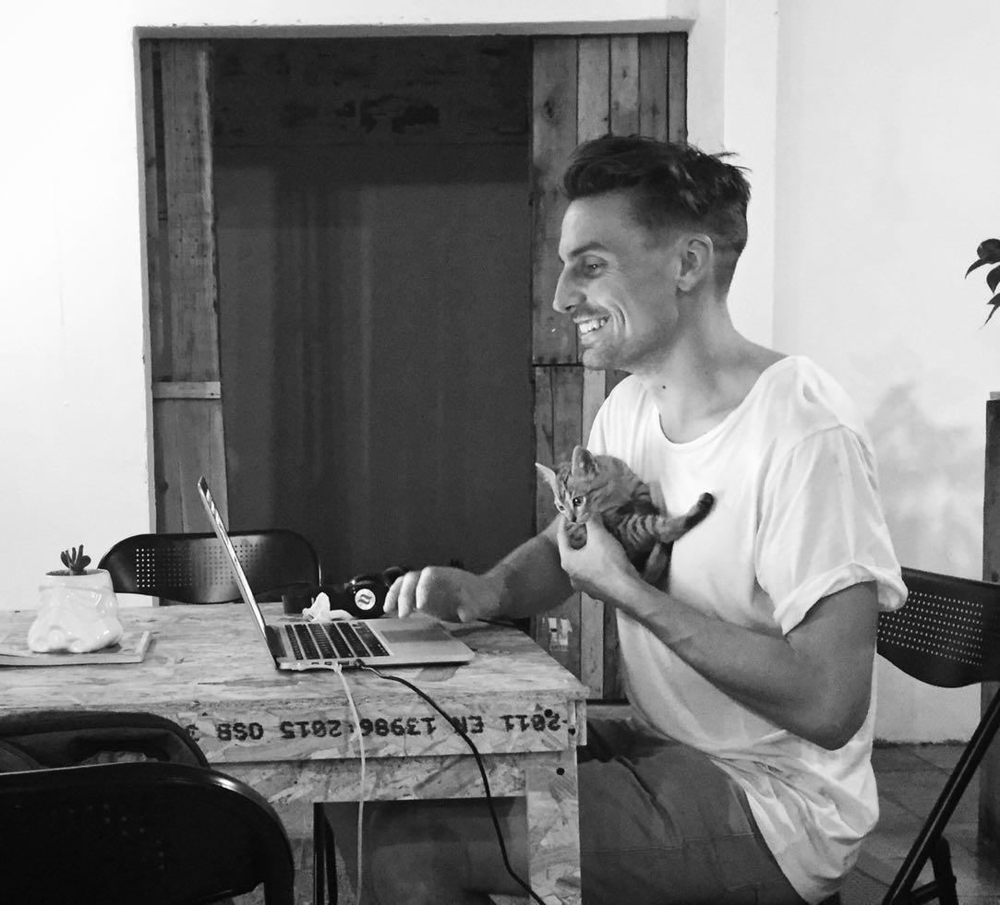

	
	

		'Almuerzo', cascada Arenales, Parque Salado, Medellin, Colombia.
	

  

	

		<b>Simulation, spatial, and bioenergetics modeller</b>           
	

### I like my data diverse, my methods savvy, my analyses reproducible, and my outputs open access.    

### I’m a computational researcher at [Emory University](https://scholarblogs.emory.edu/civitello/) working on diverse data analysis problems from simulation modelling of human disease risk to spatial and biophysical modelling of ecological systems.  

### The header tabs give a snapshot of some of my computational work. Below are links to my digital footprint.       
  
   
   

******    

[Back to top](#top)