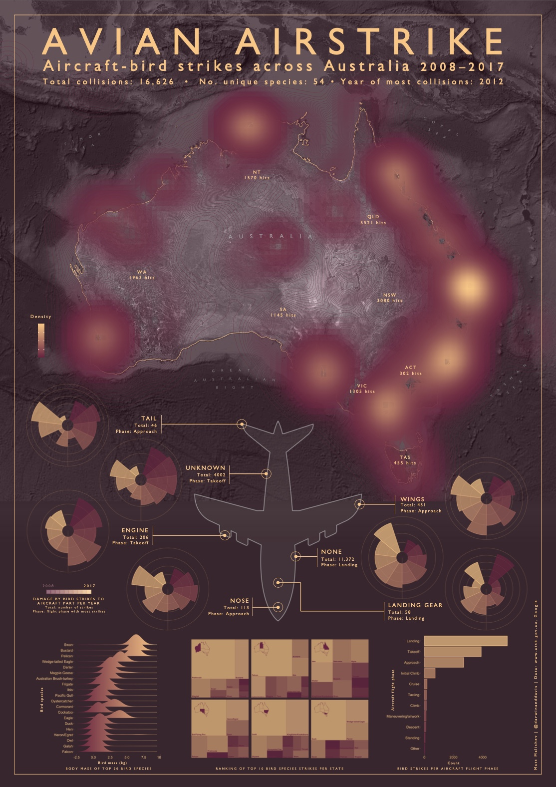

	
	

		<!-- Calle de buena mesa, Envigado, Medellin, Colombia -->
	

  

	

		<b>Data analysis, models, maps</b>             
	

I like my data diverse, my methods (somewhat) clean, my analyses reproducible, and my outputs open access.      

I'm project manager for data and visualisation within the Visual Stories Team at The Age in Melbourne, Australia, where I use data analysis/viz, open source programming, and mapping to build data-driven stories and digital content in the media landscape spanning environmental to politics to economics.     

I'm also a former research scientist and computational modeller working in simulation modelling of infectious diseases (Emory, Atlanta, USA) and energetics, biophysical ecology, biosecurity, and spatial risk mapping (Centre of Excellence for Biosecurity Risk Analysis, Melbourne, Australia).    

I also freelance in data viz/analysis and copy-editing/proofing, teach programming in 'R', co-run a digital design studio, and dabble in e-commerce.       

The header tabs show my current projects, publications, and presentations. Below are links to my digital footprint. Hit me on any of my channels for consulting, collabs, source code, or to chat about all things data.             

	Topics

     

data analysis, data science, data viz, stats, models, simulations, data pipelines, dashboards, UI/UX, rstats, research, maps, geospatial, API, opensci, rmarkdown, workshops, shiny, coding club, software      

	Tools  

     

  

  
	
	
	
	
	
	
	
	
	
  	
  	

  

    
  
******   

   

	Latest post

                    

#### Avian Airstrike: Aircraft-bird strikes across Australia (2012–2017) (infographic)     
   

          
    

#### [Check out project](./infographics.md)                 

  
   
   
  
<!-- <a class="twitter-timeline" href="https://twitter.com/darwinanddavis" data-height=1100 data-width=600 data-chrome="nofooter">Tweets by darwinanddavis</a> -->      

******    

[Back to top](#top)