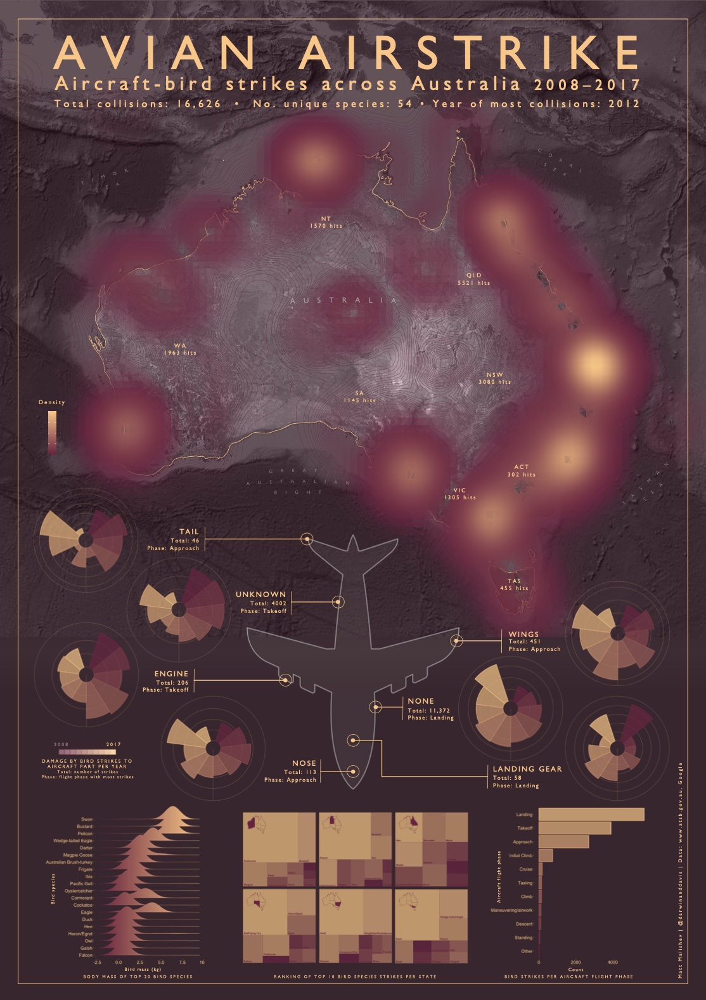

<a id="top"></a>

******    

    

******      

<br>    

## Avian Airstrike: Aircraft-bird strikes across Australia (2012–2017)        

### People    

Matt Malishev       

### Tasks  

* Create a density heatmap using satellite data as a basemap over a conventional vector basemap  
* Build an infographic exploring the full aircraft–bird strikes dataset          

### [Click to view hi-res infographic](https://github.com/darwinanddavis/infographics/blob/master/avianairstrike/avianairstrike.pdf)       
<br>      
  
      
<br>        

I originally created an [interactive map integrating R and Mapbox Studio](https://darwinanddavis.github.io/worldmaps/30daymap2021/day11) to view these data covering aircraft and bird strikes across Australia from 2008 to 2017. Lots of nice data and variables to explore from the aircraft (`AircraftDamageLevel`, `AircraftType`, `PhaseOfFlight`, `Part damaged`) and avian angle (`SpeciesFamily`, `bird_size`, `bird_mass`).      

Given the data depth, I decided to dive further and create an infographic to showcase these neat variables and present the interesting outcomes in one snapshot, which is why I like making infographics.       

      
<br>  

The tech challenge for this task was building a heatmap of lat/lon aircraft-bird strikes across Australia using hi-res satellite data as a basemap rather than a conventional vector map, which has been done to death. I ended up adding a colour overlay with a low transparency to a grayscale satellite basemap that matched the lower colour used for the colour palette in the plots you see in the infographic. This gave a subtle colour wash to the basemap that looked more intense than the standard grayscale and the data were dense enough to contrast nicely against this basemap.       

        
<br>    

      
<br>    

        
<br>    

Below is the original interactive map using R and Mapbox.   

          

### [Click for full map](https://darwinanddavis.github.io/worldmaps/30daymap2021/day11)    
(Best viewed full screen; switch browsers if loading time is slow)         

### Tools     

R      
Mapbox      
HTML    
CSS    
  
### Links      
[`R` code](https://github.com/darwinanddavis/worldmaps/tree/gh-pages/docs/30daymap2021)   

******     

<!--  project break__________________________________________________________________________________________  -->

<br>
## My First Year: Exploring daily life of a 1-year-old using [Babytracker](https://play.google.com/store/apps/details?id=com.amila.parenting&hl=en_AU&gl=US) app activity data (client project) 

### People      

Matt Malishev           

### Tasks    

* Build an printable infographic from client mobile app data        
* Analyse and wrangle data to test different data viz and plot ideas   
* Build code templates to easily integrate future data from app (potential for API)   

Daily life for the first year of a 1-year-old using client data from the [Babytracker](https://play.google.com/store/apps/details?id=com.amila.parenting&hl=en_AU&gl=US) app. Data covers activity time, sleeping, feeding and meal type, breast/bottle feeding, bath/play time, pee/poo activity, body temperature and medicine intake measurements, and growth over time. Client info within infographic is masked.       

### [View hi-res infographic](https://github.com/darwinanddavis/infographics/blob/master/myfirstyear/img/myfirstyear.pdf)         

      
<br>

Snapshot analysis and decision making on data viz outputs when confronted with different types of data.      

      
<br>

      
<br>

       
<br>  

******    

<br>
## Dissecting Tokyo 2020 Olympics medal tally data by country and medal count per event          

### People    

Matt Malishev         

### Tasks  

* Webscrape live medal tally data from the Tokyo 2020 Olympics site      
* Wrangle and analyse the data to create digestible datasets and generate data viz        
* Build an infographic using the data/plots         

This project uses webscraping, data analysis/viz, and plotting tools in `R` to access, wrangle, analyse, and plot Tokyo Olympics 2020 medal tally data to generate the graphics used in the below infographic.      

Step-by-step instructions and code are detailed in the below link. All code, compiled datasets, and source files are also available on [Github](https://github.com/darwinanddavis/misc/tree/gh-pages/olympics).                 

### Outcomes      

Tokyo 2020 Olympics medal tally infographic   

### [Writeup and analysis](https://darwinanddavis.github.io/misc/olympics/olympics.html)              

### [View hi-res infographic](https://darwinanddavis.github.io/misc/olympics/img/olympics.pdf)      

  
<br>
  
 
<br>

 
<br>

 
<br>

 
<br>
  
### Tools     
  
R             
HTML    
CSS    
JS  

```{r}    
pacman::p_load(here,rvest,xml2,dplyr,circlize,tidyr,stringr,purrr,magick,reshape2)  
```  
    
### Links            
[`R` code](https://github.com/darwinanddavis/misc/tree/gh-pages/olympics/r)        

### Data      
[Tokyo 2020 Olympics official website](https://olympics.com/tokyo-2020/olympic-games/en/results/all-sports/medal-standings.htm)      
   
******     

###### Header Infographic of medal tally analysis for Tokyo 2020 Olympics. Data: [Tokyo 2020 Olympics official website](https://olympics.com/tokyo-2020/olympic-games/en/results/all-sports/medal-standings.htm)        
******  

[Back to top](#top)|[Home page](./index.md)
