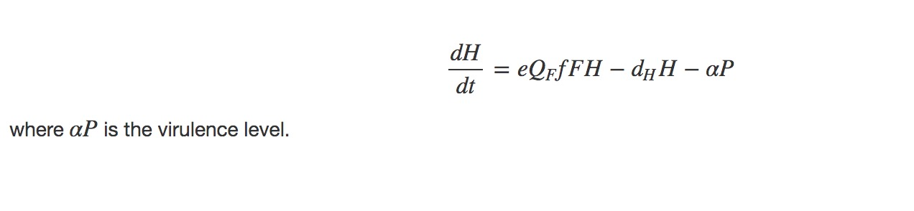
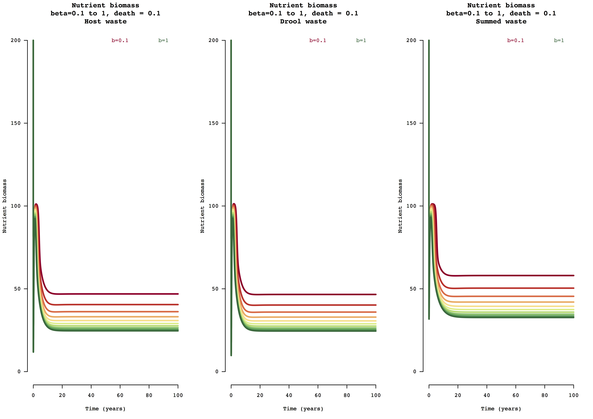

<a id="top"></a>
  
******     

  

******  

<br>
## Meta-analysis and disease transmission model for infected host biomass recycling in ecosystems         

### Location     

Living Earth Collaborative Center for Biodiversity Working Group     
St. Louis, USA        

### People   

Amanda Koltz (co-organizer), Washington University in St. Louis, USA    
Rachel Penczkowski (co-organizer), Washington University in St. Louis, USA    
Sharon Deem (co-organizer), Institute for Conservation Medicine, St. Louis Zoo, USA    
Vanessa Ezenwa (co-organizer), University of Georgia, USA    
Susan Kutz, University of Calgary, Canada    
Brandon Barton, Mississippi State University, USA    
Zoe Johnson, Mississippi State University, USA    
Aimee Classen, University of Vermont, USA    
J. Trevor Vannatta, Purdue University, USA    
**Matt Malishev, Emory University, USA**    
David Civitello, Emory University, USA      
Daniel Preston, University of Wisconsin-Madison, USA    
Maris Brenn-White, St. Louis Zoo, USA    
  
### Tasks   

* Developed a host-parasite disease transmission model with biomass conservation and nutrient cycling to capture macroparasite burden on terrestrial ungulates (wild and livestock) (model development)     
* Built a keyword query bot for scraping data from literature search terms based on user search engine results (meta-analysis)  
* Built a meta-analysis data scraper bot for scraping PDF files for user-defined data (meta-analysis)  

**Outcomes**  

* Nutrient Quota Host-Parasite (NQHP) model  
* Tic-Tac-Toe spatial Nutrient Plants Susceptible Infected (NPSI) model          
* Keyword query bot        
* Data scraper bot        

### Example outputs  
<br>    

******    

#### Nutrient Quota Host-Parasite (NQHP) model      

Gut parasite disease transmission model tracking nutrient, plant biomass (resources), susceptible and infected host, and parasite population densities with explicit nutrient exchange and recycling.       

**State variables (units = biomass)**   
N = nutrients in the landscape (biomass)  
R = food in the landscape (food biomass)  
QR = nutrient quota in food source (nutrient/carbon ratio). QF⋅ is total nutrients in food.  
H = host consumer population (host biomass)  
QH = nutrient quota in hosts (nutrient/carbon ratio)  
P = parasite population (within-host parasite biomass)    

**Parameters**  
α = virulence  
dH = death rate of hosts  
dP = death rate of parasites  
l = nutrient loss  
mF = maximum food biomass  
mH maximum host biomass  
μM = maximum uptake rate of biomass  
F = carbon biomass in food biomass  
QR = nutrient to carbon (N/C) ratio in food biomass, so that QR⋅R is the nutrient level in food biomass  
Recycling = e⋅QF⋅f⋅F⋅H  

**Nutrient growth (biomass)**      
    

**Food growth (biomass)**  
  

**Nutrient quota of food source**  
    

**Host population growth (host biomass)**    
  

**Nutrient quota in hosts (nutrient/carbon ratio)**  
  

**Parasite population (within-host parasite biomass)**     
  
<br>  
<br>  

     
###### Figure 1. Example model output for nutrient (biomass) change over 100 years for the host waste, drool waste, and summed waste resource uptake and nutrient leaching modes of susceptible and infected host populations for beta transmission range [0,1].     


[Link to project page.](http://htmlpreview.github.io/?https://raw.githubusercontent.com/darwinanddavis/LECWorkingGroup/master/nqhp_model.html)    

******  

#### Tic-Tac-Toe spatial Nutrient Plants Susceptible Infected (NPSI) model    

Consumer-resource disease transmission model of parasite loading on nutrient cycling in ecosystems as a spatial individual-based model of resources, host populations, and disease vector populations.  

The project aims to predict how resource biomass uptake and release by infected and non-infected host populations varies under a disease mosaic landscape. Disease patches in the landscape are driven by feedback between modes and rates of disease transmission and costs of parasite occurrence and nutrient deposit in space and time.        

[Link to project page.](http://htmlpreview.github.io/?https://raw.githubusercontent.com/darwinanddavis/LECWorkingGroup/master/tictactoe.html)      

******  

#### Keyword query bot 

The bot reads a `.txt` file containing literature entries resulting from a keyword search term query similar to a Web of Science database search. It then converts this file into a readable `.csv` file with each row as separate data, in this case, research articles. Using user-defined keyword search terms, it then scrapes the `.csv` file and returns a new file saved to the user's local hard drive with the final data entries containing the user-defined search terms. Users can define what part of the article they want to search, e.g. _Title_, _Author_, _Abstract_, etc.       

1. [Download the instructions for running the bot in `R`](https://github.com/darwinanddavis/LECWorkingGroup/raw/master/keyword_scrape/lec_keyword_search.pdf)    
2. [Download the model file (right click here and 'Save link as')](https://github.com/darwinanddavis/LECWorkingGroup/raw/master/keyword_scrape/lec_keyword_search.R?raw=true)      
3. Run the model in `R`. The final outputs will save to your local directory.      

> _keyword_final.csv_  
> _keyword_final_isolated.csv_

Keyword query bot `R` code  

Required files:  

> LEC100testrecords.txt  
> search_term_inputs.txt  
> article_col_names.txt  
> lec_keyword_search.R    

<!-- ________________________________________  code chunk ________________________________________  -->

Load packages and set working directory.      
```r
##########################################################################

# load packages (run once) ------------------------------------------------

install.packages("pacman")
require(pacman)
p_load(dplyr,purrr,readr)

# user inputs -------------------------------------------------------------

# set working dir
setwd("your working dir")
```

Choose whether to search the Title or the Abstract for the keywords and what article data you want returned, e.g. year of publication, the entire abstract, etc.      
```r
# Step 1 ----------------------------------------------------------------------

# Enter either Title or Abstract to search for the keywords
extract1 <- "Title" 

# Step 2 ------------------------------------------------------------------

# Now enter what data you want to get out of the final results
# For example, if you want to know what year in which the resulting papers were published,
# type in "Year"
# use any search term you specified in the search_terms_input file
extract2 <- "Year"
```

Open the `search_term_inputs.txt` file with a standard text editor and type in the following information.   

**First line**    
Your working directory where this document and the associated files are located. e.g.  

`/User/documents/models`    

**Second line**     
Your search terms, separated by a comma. Spaces and lower/upper cases are OK too. For example, if you want to search for the following terms:   

> evidence  
> human    
> africa     
  
You would type in the following:  

`evidence, human, africa`    
  
**Third line**    
Enter the data entry you want to run the keyword search terms on from the below list. Note, case sensitive.    

Primary entries:   
Abstract    
Author    
Title  
Year  

Other possible entries:  
BCI    
CorrAuthor  
ISSN   
Issue   
Journal    
Link  
Pages   
PubDate  
Volume  

**Fourth line (optional)**    
You can also enter what data you want to isolate from the final results to save as a separate file. For example, if you want to know just the year in which the selected papers were published, type in Year. Otherwise, leave blank.  


Save the `search_term_inputs.txt` file and run the rest of the `R` code.    

```r
##########################################################################

# run rest of code from here ----------------------------------------------
# read in file ----------------------------------------------------------

fh <- "LEC100testrecords.txt"
anomalies <- 1 # save csv file of entries that contain the term 'Go to ISI' instead of article title 

ww <- readLines("search_term_inputs.txt") # set working dir
wd <- setwd(ww[1]) 
tt <- read.delim(paste0(wd,"/",fh),header=T,sep="\t")
tt %>% str
# set column names for df from file
df_colnames <- read.delim("article_col_names.txt",header=F,strip.white = T,sep=",",colClasses = "character")[1,] %>% as.character
colnames(tt) <- df_colnames

# view structure of data frame
tt %>% str
# randomly sample entries to see if contents align with the above col names
tt[sample(126,1),]

# key terms ---------------------------------------------------------------

keyterms <- read.delim("search_term_inputs.txt",header=F,skip=1,strip.white = T,sep=",",colClasses = "character")[1,] %>% as.character
keyterms <- keyterms %>% as.character ; keyterms_neat <- keyterms
keyterms <- paste(keyterms,collapse="|"); keyterms_neat # combine all the search terms 

final <- tt[grep(keyterms, tt[,extract1], ignore.case = T),] #
length(final[,extract1]) # get number of results
tt[final[,extract1],extract1] # show raw outputs 

### Remove NA columns  
rm_na <- grep("NA", names(tt), ignore.case = F)
final[,colnames(final[,rm_na])] <- list(NULL)

# extract isolated data col
ww <- as.list(ww); names(ww) <- ww
col_final <- ww[extract2] %>% as.character()
if(col_final!=""){final[,col_final]} # return as vector

# remove duplicate entries
final <- unique(final)

## Save output to file  
fho <- "keyword_final.csv"
write_csv(final,paste0(wd,"/",fho))

## Save isolated results data to file  
# final[col_final] # return as data frame column    
if(col_final!=""){
  final_isolated <- final[,col_final] # return as vector
  final_isolated <- as.data.frame(final_isolated); colnames(final_isolated) <- col_final
  fho_iso <- "keyword_final_isolated.csv"
  write.csv(final_isolated,paste0(wd,"/",fho_iso))
  cat(rep("\n",2),"Your results are saved as\n\n",fho_iso,"\n\n in","\"",wd,"\"","\n\n showing just",col_final,"data",rep("\n",2))
}

## Anomalies
### Here are the entries that contain the default term "<Go to ISI>" in the title column from the original data 
if(anomalies==1){
  gti <- "<Go to ISI>"
  search_func_gti <- grep(gti, tt[,"Title"], ignore.case = T)
  final_gti <- tt[search_func_gti,] #
  length(final_gti[,"Title"]) # get number of results
  tt[final_gti[,"Title"],"Title"] # confirm against raw data
  cat("Rows from original data where entries occur:\n",search_func_gti) # rows from original data where entries occur

  ### Remove NA columns  
  rm_na <- grep("NA", names(tt), ignore.case = F)
  final_gti[,colnames(final_gti[,rm_na])] <- list(NULL)
  
  ### Save anomalies to file
  fho_isi <- "keyword_final_anomalies.csv" # save these anomalies to local dir
  write.csv(final_gti,paste0(wd,"/",fho_isi))
  cat(rep("\n",2),"Your results are saved as\n\n",fho_isi,"\n\n in","\"",wd,"\"",rep("\n",2))
}

# final 
cat(rep("\n",2),"Your results are saved as\n\n",fho,"\n\n in","\"",wd,"\"","\n\n using the following search terms:\n\n",keyterms_neat,rep("\n",2),
"Total papers when searching",col2search,":",length(final[,col2search]))

```
<!-- ________________________________________ end code chunk ________________________________________  -->

The two files will be saved to your local working directory:  

> _keyword_final.csv_    
> _keyword_final_isolated.csv_    

**Results**

Input: Snippet of raw data from default Web of Science keyword search query.      

<!-- ________________________________________ code chunk ________________________________________  -->
```
H. Ebedes	1975	THE CAPTURE AND TRANSLOCATION OF GEMSBOK ORYX GAZELLA-GAZELLA IN THE NAMIB DESERT WITH THE AID OF FENTANYL ETORPHINE AND TRANQUILIZERS		Journal of the South African Veterinary Association			46		4	359-362								THE CAPTURE AND TRANSLOCATION OF GEMSBOK ORYX GAZELLA-GAZELLA IN THE NAMIB DESERT WITH THE AID OF FENTANYL ETORPHINE AND TRANQUILIZERS		0038-2809												BCI:BCI197763001378				"Gemsbok (23) in the Namib Desert were captured with combinations of fentanyl or etorphine hydrochloride, hyoscine hydrobromide and tranquilizers such as axaperione, SU-9064 [methyl 18-epereserpate methyl ether hydrochloride], triflupromazine hydrochloride and acetylpromazine maleate. Fentanyl, a new immobilizing compound proved to be safe and effective for gemsbok. The gemsbok were chased on the interdune plains and darted from a Land Rover with the Palmer powder-charge Cap-Chur gun. A 6-seater helicopter was used on a trial basis to dart gemsbok but it is suggested that a small more maneuvrable helicopter be used for further operations. All the gemsbok were transported under narcosis from the capture area to an enclosure. Chlorpromazine hydrochloride was injected into the captured gemsbok to sedate them in their new confined environment. Tranquilizers such as chlorpromazine hydrochloride, acetylpromazine maleate and a new tranquilizer SU-9064 were used to sedate the animals during long distance transportation in crates. This prevented the animals from injuring themselves and damaging the crates. For the 1st time in South West Africa wild animals were transported by air. A journey by road which under normal circumstances would have taken over 40 h was completed in less than 9 h by air. There were no losses during transportation and only 2 gemsbok were injured during the translocation operation."			<Go to ISI>://BCI:BCI197763001378
"K. A. Durham, R. E. Corstvet and J. A. Hair"	1976	APPLICATION OF FLUORESCENT ANTIBODY TECHNIQUE TO DETERMINE INFECTIVITY RATES OF AMBLYOMMA-AMERICANUM ACARINA IXODIDAE SALIVARY GLANDS AND ORAL SECRETIONS BY THEILERIA-CERVI PIROPLASMORIDA THEILERIIDAE		Journal of Parasitology			62		6	1000-1002								APPLICATION OF FLUORESCENT ANTIBODY TECHNIQUE TO DETERMINE INFECTIVITY RATES OF AMBLYOMMA-AMERICANUM ACARINA IXODIDAE SALIVARY GLANDS AND ORAL SECRETIONS BY THEILERIA-CERVI PIROPLASMORIDA THEILERIIDAE		0022-3395		
```
<!-- ________________________________________ end code chunk ________________________________________  -->

Output: Queried data based on user search terms (truncated).      

Author | Year | Title | Journal | Pages 
--------------------- | --------------------- | --------------------- | --------------------- | ---------------------
E. Dyason | 2010 | Summary of foot-and-mouth disease outbreaks reported in and around the Kruger National Park, South Africa, between 1970 and 2009 | Journal of the South African Veterinary Association | 201-206   
M. R. Dunbar, W. J. Foreyt and J. F. Evermann | 1986 | Serologic evidence of respiratory syncytial virus infection in free-ranging mountain goats Oreamnos americanus | Journal of Wildlife Diseases | 415-416 
H. T. Dublin, A. R. E. Sinclair, S. Boutin | 1990 | Does competition regulate ungulate populations further evidence from Serengeti, Tanzania | Oecologia (Berlin) | 283-288  
C. Caruso, S. Peletto, F. Cerutti | 2017 | Evidence of circulation of the novel border disease virus genotype 8 in chamois | Archives of Virology | 511-515  

<br> 

******    

#### Data scraper bot    

The data scraper bot gleans data from PDF articles (`.pdf`) based on user defined search terms and returns a local file of meta-analysis data.  
  
Example search terms:  

> mortality, surviv*, fecund*, body condit*, body, body mass, feed*, feeding rate, feeding amount, waste, faec*, fece*, urin*, ecosystem, plant, soil, nutrie*  


Data scraper bot `R` code 
<!-- ________________________________________ code chunk ________________________________________  -->
```r
# extract data from pdfs

### before running ###
# 1. delete first summary page of PDF if present
# 2. set search terms for each output 

#################################### load packages
packages <- c("pdftools","tidyverse","stringr") 
if (require(packages)) {
  install.packages(packages,dependencies = T)
  require(packages)
}
ppp <- lapply(packages,require,character.only=T); if(any(ppp==F)){
	cat("\n\n\n ---> Check packages are loaded properly <--- \n\n\n")
	}

#################################### set wd
wd <- "your working dir"
pdf_folder <- "folder where pdf files live"
setwd(wd)

colC <- list() # create empty list for relevance data (colC in LEC data extraction sheet)
unreadable_pdf <- list() # list for storing unreadable pdfs
colC_names <- c("PaperID","C")

# set col names for output 
rv_names <- paste(
  "Relevance",
  "Parasite type",
  "Response variable",
  "Effect variance",
  "Sample size",
  "P val",sep=",Line number,"
)

#################################### read in pdfs from dir  
f <- 1
file_list<-list.files(paste0(wd,"/",pdf_folder,"/")) # list files
file_list
pdf_list<-as.list(rep(1,length(file_list))) # empty list
for (f in 1:length(pdf_list)){ # read in pdfs
  p <- pdf_text(paste0(wd,"/",pdf_folder,"/",file_list[f])) # read pdf
  p <- read_lines(p) # convert to txt file
  pdf_list[[f]]<-p# save to master pdf list  
}
names(pdf_list) <- file_list # name list elements as paprer IDs
file_list # show files in dir
if(length(pdf_list)!=length(file_list)){cat("\n\n Check all pdfs in directory have been loaded \n\n")}

######################################## choose paper to scrape 
# loop through files in pdf dir 
nn <- 1

for(nn in 1:length(file_list)){ 
  fh <- file_list[nn]; fh 
  # only scrape PDFs with content that can be read
   if(pdf_list[fh][[fh]][1]==""){ # if the first line is empty
     nn <- nn + 1
     fh <- file_list[nn]
     unreadable_pdf[nn] <- fh # add troublesome pdfs to list to remove 
     unreadable_pdf <- unlist(unreadable_pdf); unreadable_pdf <- unreadable_pdf[!is.na(unreadable_pdf)]
   }
   cat(fh,"\n",nn,"\n")
   
  #################################### read in title or abstract terms
  title_abstract_terms <- as.character(read.delim("title_abstract_terms.txt",header=F,strip.white = T,sep=",",colClasses = "character")[1,])
  title_abstract_terms <- as.character(title_abstract_terms);title_abstract_terms_neat <- title_abstract_terms
  title_abstract_terms <- paste(title_abstract_terms,collapse="|");title_abstract_terms_neat # combine all the search terms 
  
  single_paper <- 1 # read in files from dir or individual papers
  if(single_paper==1){
    p1 <- pdf_list[[fh]] # read in individual paper 
  
    # ID paper, Nth line
    line_number <- 100
    p1[line_number] 
  }
  
  # isolate title and abstract in paper
  ta_length <- 1:50 # set number of lines for title and abstract in pdf
  p1_ta <- p1[ta_length] # first 80 lines of pdf 
  
  # remove whitespace
  str_squish(p1)
  
  ########################################    1. check whether title and abstract has key terms
  if(single_paper==0){
    for(kt in file_list){
      # this is for the master pdf
      relevance_return <- grep(title_abstract_terms,pdf_list[[kt]][ta_length],ignore.case = T) # scrape title and abstract for terms in protocol doc
      }
    }else{
      # this is for reading individual files
      relevance_return <- grep(title_abstract_terms,p1_ta,ignore.case = T) # scrape title and abstract for terms in protocol doc
    } # end single_paper == 0
    
  if(length(relevance_return)>1){ # if search terms return nothing, set data for that paper to NAs 
    relevance_final <- "YES"
  }else{
    relevance_final <- "MAYBE"}
  
  ########################################    2. scrape files for data  ########################################
  
  ######################################### parasite type
  nematode_terms <- as.character(c("nemat*","Nemat*","helmin*","Helmin*","cestod*","Cestod*","tremat*","Tremat*"));nematode_terms_neat <- nematode_terms
  nematode_terms <- paste(nematode_terms,collapse="|");nematode_terms_neat # combine all the search terms 
  
  #### choose paper
  p1_nematode <- pdf_list[[fh]] # read in individual paper 
  
  # this is for reading individual files
  nematode_return <- grep(nematode_terms,p1_nematode,ignore.case = T) # scrape title and abstract for terms in protocol doc
  nematode <- p1_nematode[nematode_return] # return terms in paper
  
  ######################################### response variable
  response_terms <- as.character(c("BCI","bci","body mass","bodymass","weig*","feedi*","feeding rate","uptak* rat*","mortal*","surviv*","defeca*","fecun*","urinat*","nutrie*","soil","plant biomass"));response_terms_neat <- response_terms
  response_terms <- paste(response_terms,collapse="|");response_terms_neat # combine all the search terms 
  
  #### choose paper
  p1_response_var <- pdf_list[[fh]] # read in individual paper 
  
  # this is for reading individual files
  response_var_return <- grep(response_terms,p1_response_var,ignore.case = T) # scrape title and abstract for terms in protocol doc
  response <- p1_response_var[response_var_return] # return terms in paper
  
  ######################################### effect size variance 
  effect_var_terms <- c("SE", "SD", "CI"); effect_var_terms_neat <- effect_var_terms
  effect_var_terms <- paste(effect_var_terms,collapse="|")
  
  p1_effect <- pdf_list[[fh]] # select paper
  
  effect_var_return <- grep(effect_var_terms,p1_effect,ignore.case = F) # scrape title and abstract for terms in protocol doc
  effect_var <- p1_effect[effect_var_return] # return all outputs
  # effect_var_final <- paste(unlist(effect_var), collapse='')# turn into one character string
  
  ######################################### sample size 
  n_val_terms <- c("n =", "n=", "N =", "N="); n_val_terms_neat <- n_val_terms
  n_val_terms <- paste(n_val_terms,collapse="|")
  
  p1_nval <- pdf_list[[fh]] # select paper
  
  nval_return <- grep(n_val_terms,p1_nval,ignore.case = F) # scrape title and abstract for terms in protocol doc
  nval <- p1_nval[nval_return] # return all outputs
  # pval_final <- paste(unlist(pval), collapse='')# turn into one character string
  
  
  ######################################### p value 
  p_val_terms <- c("p =", "p=", "p <", "p<", "p >", "p>","P =", "P=", "P <", "P<", "P >", "P>"); p_val_terms_neat <- p_val_terms
  p_val_terms <- paste(p_val_terms,collapse="|")
  
  p1_pval <- pdf_list[[fh]] # select paper
  
  pval_return <- grep(p_val_terms,p1_pval,ignore.case = F) # scrape title and abstract for terms in protocol doc
  pval <- p1_pval[pval_return] # return all outputs
  # pval_final <- paste(unlist(pval), collapse='')# turn into one character string
  
  ######################################## save output
  
  out_list <- list(relevance_final,relevance_return, nematode, nematode_return, response, response_var_return, effect_var, effect_var_return, nval, nval_return, pval, pval_return) # merge results into list
  n.obs <- sapply(out_list, length) # get number of obs for each element
  seq.max <- seq_len(max(n.obs)) # fill in missing number of cols to make below matrix the same length
  rv <- sapply(out_list, "[", i = seq.max) # turn into matrix
  rv <- as.data.frame(rv) # convert to df
  colnames(rv) <- rv_names # name cols 
  
  # write out to dir
  fout <- paste0(as.character(strsplit(fh,".pdf")),".csv") # create file name 
  write.csv(rv,fout) # save to dir 

} # end loop
unreadable_pdf # pdfs that can't be read 
```
<!-- ________________________________________ end code chunk ________________________________________  -->
**Results**  

Input: Text strings as keywords to scrape PDF files.   

> "nemat*", "Nemat*", "helmin*", "Helmin*", "cestod*", "Cestod*", "tremat*", "Tremat*"  

> "BCI", "bci", "body mass", "bodymass", "weig*", "feedi*", "feeding rate", "uptak* rat*", "mortal*", "surviv*", "defeca*", "fecun*", "urinat*", "nutrie*", "soil", "plant biomass"    

> "SE", "SD", "CI"    

Output: Queried data based on user search terms (truncated).    

Relevance | Line number | Parasite type |  Response variable
--------------------- | --------------------- | --------------------- | --------------------- 
YES | 6 | Lung and gastrointestinal nematodes | Two grams of faeces was weighed and mixed with 28 ml
NO | 15 | nematode eggs and lungworm larvae | both showed negative correlations with post-weaning weight gain 
MAYBE | 27 | Strongylid nematode eggs | weak positive correlation between buffalo fly counts and post-weaning weight gain 

### Links    

[Project page on Github.](https://github.com/darwinanddavis/LECWorkingGroup)          

<br>  
<br>  

###### Header image: A 100-year model forecast of susceptible host biomass (left) and population density (right) under macroparasite infection with low transmission rate and high host mortality rate.        
******  

[Back to top](#top)|[Home page](./index.md)
