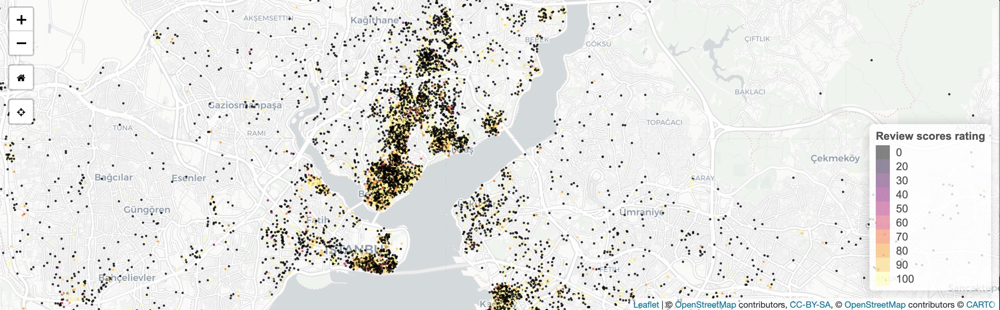

<a id="top"></a>

******    

       

<br>
## Dissecting Tokyo 2020 Olympics medal tally data by country and medal count per event          

### People    

Matt Malishev         

### Tasks  

* Webscrape live medal tally data from the Tokyo Olympics site      
* Wrangle and analyse the data to create digestible datasets and generate data viz        
* Build an infographic using the data/plots         

This project uses webscraping, data analysis/viz, and plotting tools in `R` to access, wrangle, analyse, and plot Tokyo Olympics 2020 medal tally data to generate the graphics used in the below infographic.      

Step-by-step instructions and code are detailed in the below link. All code, datasets, and source files are also available on [Github](https://github.com/darwinanddavis/misc/tree/gh-pages/olympics).                 

### Outcomes      

Tokyo 2020 Olympics medal tally infographic   

### [Writeup and analysis](https://darwinanddavis.github.io/misc/olympics/olympics.html)              

### [View hi-res infographic](https://darwinanddavis.github.io/misc/olympics/img/olympics.pdf)      

  
<br>
  
 
<br>

 
<br>
  
### Tools     
  
R             
HTML    
CSS    
JS  

```{r}    
pacman::p_load(here,rvest,xml2,dplyr,circlize,tidyr,stringr,purrr,magick,reshape2)  
```  
    
### Links            
[`R` code](https://github.com/darwinanddavis/misc/tree/gh-pages/olympics/r)        

### Data      
[Tokyo 2020 Olympics official website](https://olympics.com/tokyo-2020/olympic-games/en/results/all-sports/medal-standings.htm)      
   
******     

[Back to top](#top)|[Home page](./index.md)
