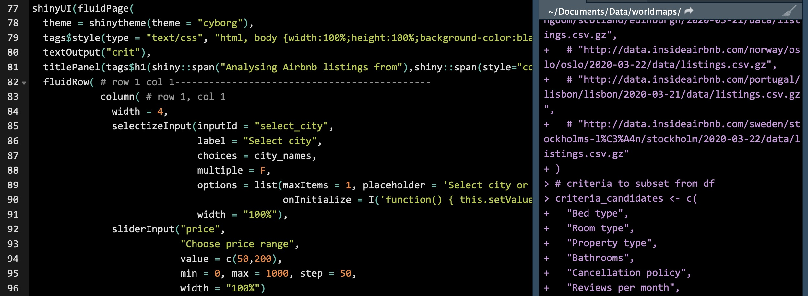

******  
    

******  

       

## [Spatial](./spatial.md)  

 
  
******  

   

## [Disease](./disease.md)  
  
      

******  

   

## [Meta-analysis](./meta.md)  

  
  
******    

   

## [Time series](./time_series.md)  

  
  
******    

   

## [Software](./coding_club.md)      

  
******    

   
   

###### Header image: Analysing Hong Kong's Airbnb listings using Airbnb open data with Shiny in R.      
******  

[Back to top](#top)|[Home page](./index.md)
