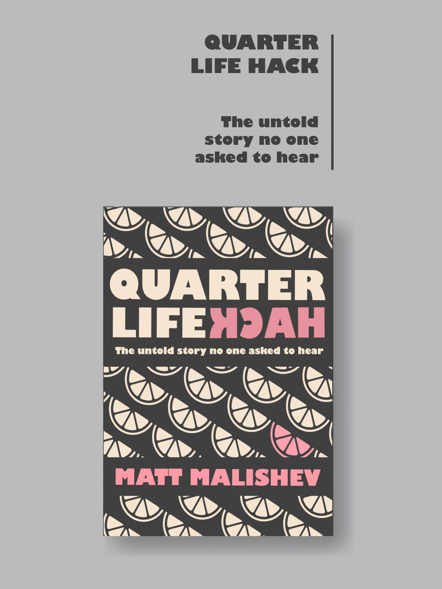

---
layout: page
title: Publications  
permalink: /publications/
---  

******      

 

## Works in progress      

   

<!--  project break__________________________________________________________________________________________  -->

******        
    
    
     
## Peer review papers  
(*Awarded article, ^Equal contribution)       

**Malishev M** & Civitello DJ. When should we expect predator biocontrol of human schistosomes to backfire? _In review._ [doi: 10.22541/au.159363335.59711205](https://www.authorea.com/users/151128/articles/465169-when-should-we-expect-predator-biocontrol-of-human-schistosomes-to-backfire?commit=322f091742e2adfdd4d3b9abd16123afdf17d92d).         

Koltz AM, Civitello DJ, Becker DJ, Deem SL, Classen AT, Barton BT, Brenn-White M, Johnson ZE, Kutz S, **Malishev M**,  Preston DL, Vannatta JT, Penczykowski RM^ & Ezenwa VO^. Sublethal effects of parasitism on ruminants have cascading
consequences for ecosystems. _In prep._   

**Malishev M** & Kramer-Schadt S (2021) Movement, models, and metabolism: Individual-based energy budgets as next-generation extensions for modelling animal movement outcomes across scales. _Ecological Modelling,_ 441: 109413. [https://doi.org/10.1016/j.ecolmodel.2020.109413](https://doi.org/10.1016/j.ecolmodel.2020.109413).    
  
Ezenwa VO, Civitello DJ, Barton BT^, Becker DJ^, Brenn-White M^, Classen AT^, Deem SL^, Johnson ZE^, Kutz S^, **Malishev M^**, Penczykowski RM^, Preston DL^, Vannatta JT^ & Koltz AM (2020) Infectious diseases, livestock, and climate: a vicious cycle? _Trends in Ecology and Evolution,_ 35(11): P959-962 [https://doi.org/10.1016/j.tree.2020.08.012](https://doi.org/10.1016/j.tree.2020.08.012).  
  
**Malishev M** & Civitello DJ (2020) Modelling how resource competition among snail hosts affects the mollusciciding frequency and intensity needed to control human schistosomes. _Functional Ecology,_ 34(8): 1678–1689. [https://doi.org/10.1111/1365-2435.13602](https://besjournals.onlinelibrary.wiley.com/doi/abs/10.1111/1365-2435.13602).          
  
**Malishev M** & Civitello DJ (2019) Linking bioenergetics and parasite transmission models suggests mismatch between snail host density and production of human schistosomes. _Integrative and Comparative Biology,_ 59(5): 1243–1252. [https://doi.org/10.1093/icb/icz058](https://academic.oup.com/icb/advance-article-abstract/doi/10.1093/icb/icz058/5497795?redirectedFrom=fulltext).      

**Malishev M** *, Bull CM & Kearney MR (2018) An individual-based model of ectotherm movement integrating metabolic and microclimatic constraints. _Methods in Ecology and Evolution,_ 9(3): 472–489, [https://doi.org/10.1111/2041-210X.12909](https://besjournals.onlinelibrary.wiley.com/doi/abs/10.1111/2041-210X.12909).   

Kearney MR, Munns SL, Moore D, **Malishev M** & Bull CM (2018) Field tests of a general ectotherm niche model show how water can limit lizard activity and distribution. _Ecological Monographs,_ 88(4): 672–693, [https://doi.org/10.1002/ecm.1326](https://esajournals.onlinelibrary.wiley.com/doi/abs/10.1002/ecm.1326).   

Fraser H, Soanes K, Jones C, Jones S & **Malishev M** (2017) The value of virtual conferencing for ecology and conservation. _Conservation Biology,_ 31(3): 540–546, [https://doi.org/10.1111/cobi.12837](https://conbio.onlinelibrary.wiley.com/doi/full/10.1111/cobi.12837).    

Sperfeld E, Wagner ND*, Halvorson HM^, **Malishev M^** & Raubenheimer D (2017) Bridging Ecological Stoichiometry and Nutritional Geometry with homeostasis concepts and integrative models of organism nutrition. _Functional Ecology,_ 31(2): 286–296, [https://doi.org/10.1111/1365-2435.12707](https://besjournals.onlinelibrary.wiley.com/doi/full/10.1111/1365-2435.12707).       

Sperfeld E^, Halvorson HM^, **Malishev M**, Clissold F & Wagner ND (2016) Woodstoich III: Integrating tools of Nutritional Geometry and Ecological Stoichiometry to advance element budgeting and the prediction of consumer-driven nutrient recycling. _Oikos,_ 125: 1539–1553, [https://doi.org/10.1111/oik.03529](https://onlinelibrary.wiley.com/doi/abs/10.1111/oik.03529).    

**Malishev M** & Sanson GD (2015) Leaf mechanics and herbivory defence: how tough tissue along the leaf body deters growing insect herbivores. _Austral Ecology,_ 40: 300–308, [https://doi.org/10.1111/aec.12214](https://onlinelibrary.wiley.com/doi/abs/10.1111/aec.12214).    

<!--  project break__________________________________________________________________________________________  -->

******        
    
    
     
## Book chapters  

**Malishev M** (2017) How to Master Punctuation in Academic English Writing? _In How to Fix your Academic English and Publish your Research Faster_. Eds. Ozy Abram et al.      
[Buy on Amazon](https://www.amazon.com/dp/B078H5P4Y7)       
[Homepage](http://uni-edit.press/en/)        

**Malishev M** (2017) Insider Info on Editing, Writing, and Publishing your Research. _In How to Fix your Academic English and Publish your Research Faster_. Eds. Ozy Abram et al.      
[Buy on Amazon](https://www.amazon.com/dp/B078HCP3LY)      
[Homepage](http://uni-edit.press/en/)      

**Malishev M** (2017) The Secrets to Selecting a Target Journal and Publishing Faster. _In How to Fix your Academic English and Publish your Research Faster_. Eds. Ozy Abram et al.      
[Buy on Amazon](https://www.amazon.com/dp/B078H278VZ)        
[Homepage](http://uni-edit.press/en/)            

<!--  project break__________________________________________________________________________________________  -->

******        
    
    
     
## Theses   

**Malishev M** (2017) On the mechanisms of animal movement from first principles, PhD thesis, School of Biosciences, University of Melbourne.   

**Malishev M** (2009) Biomechanics of herbivory defence, Honours thesis, School of Biological Sciences, Monash University.          
  
<!--  project break__________________________________________________________________________________________  -->

******        
    
       

## Community service    

Embrace Education 'Our Story', [https://www.embrace-education.org/](http://www.embrace-education.org/#!our-story/c1cev).    

'Uni students help refugees Embrace Education', Nov 4, 2011, [Probono Australia](www.probonoaustralia.com.au).  

'Embracing the plight of disadvantaged students', Monash University newsletter, [Nov 18, 2011](https://www.monash.edu/news/articles/embracing-the-plight-of-disadvantaged-school-students).   

Community Fundraising: 'Race Against Depression', November 2011 e-newsletter, [www.lifeline.org](www.lifeline.org).         
  
'Generation Y-worry still unfazed by credit woes', The Age, [Nov 2, 2008](https://www.smh.com.au/national/generation-yworry-still-unfazed-by-credit-woes-20081101-5fxq.html).        

<!--  project break__________________________________________________________________________________________  -->

******        
    
    

## Media and blog posts    

Climate change has a cow and worm problem, [_The Verge_](https://www.theverge.com/21505736/climate-change-cattle-livestock-infectious-disease-methane), Oct 7, 2020.      

Sicker livestock may increase climate woes, [_The Source_](https://source.wustl.edu/2020/10/sicker-livestock-may-increase-climate-woes/), Washington University, Oct 7, 2020.   

Where do Animals Spend Their Time and Energy? Theory, Simulations and GPS Trackers Can Help Us Find Out, [Methods in Ecology and Evolution blog](https://methodsblog.com/2019/05/22/movement-metabolism-microclimate/), May 22, 2019.      

**Malishev M** (2017, May 24) Middle Eastern fare at Mr. Lawrence warms the winter beachside. [Blog] The Plus Ones.     

**Malishev M** (2017, May 19) Good Beer Week: Boilermaker House presents Uptown Funk with La Sirene ales, cheese, and whisky. [Blog] The Plus Ones.      

**Malishev M** (2017, Mar 24) KOYAANISQATSI Live! Mind-warping documentary with the Philip Glass Ensemble. [Blog] The Plus Ones.   

**Malishev M** (2017, Feb 24) Row, row, row your inflatable, gently down the Yarra: The Inflatable Regatta 2017. [Blog] The Plus Ones.  

**Malishev M** (2017, Jan 27) Tycho blissfully melts eardrums and warps perception at 170 Russell. [Blog] The Plus Ones.    

**Malishev M** (2016, Dec 12) Hannibal Buress stand-up comedy in ‘The Hannibal Montanabal Experience’. [Blog] The Plus Ones.      

**Malishev M** (2016, Nov 22) In burgers we eat: Three One 2 One launches new burgers and shakes menu. [Blog] The Plus Ones.    

**Malishev M** (2016, Nov 21) Meet Fancy Hank’s, the BBQ haven serving delicious, smoked meats. [Blog] The Plus Ones.    

**Malishev M** (2016, Sep 24) Trap Lord A$AP Ferg lights up 170 Russell. [Blog] The Plus Ones.   

**Malishev M** (2016, Aug 29) Boozy Brunch #12 brings Dutchess to the boozy masses. [Blog] The Plus Ones.    

**Malishev M** (2016, Aug 14) Getting low to the jazz-funk hip hop of The Internet at 170 Russell. [Blog] The Plus Ones.  

**Malishev M** (2016, Aug 2) Leon Bridges live at the Forum Theatre. [Blog] The Plus Ones.  

**Malishev M** (2016, July 19) Ditch the cucumber sandwiches and scones for beats, tea, and high times at MzRizk’s Hip Hop High Tea. [Blog] The Plus Ones.    

**Malishev M** (2016, July 18) Australian Drinks Festival 2016: Rum brunch, gin lunch, and vodka dessert. [Blog] The Plus Ones.    

**Malishev M** (2016, June 27) International in flavour, cosmopolitan in style: Client Liaison gig at Forum. [Blog] The Plus Ones.  

**Malishev M** (2016, June 20) When experimental sound meets electro meets war-torn Kuwait: Fatima Al Qadiri gig at Howler. [Blog] The Plus Ones.  

**Malishev M** (2016, June 14) Booze, brunch, and a classy bunch: the 10th Boozy Brunch at Saké Restaurant. [Blog] The Plus Ones.  

**Malishev M** (2016, June 7) Hip Hop–Electro Synth Pop Queen Tkay Maidza at Howler. [Blog] The Plus Ones.  

**Malishev M** (2016, May 28) Whisky, cigars, and stargazing: Balvenie whisky tasting at Loop Roof. [Blog] The Plus Ones.  

**Malishev M** (2016, May 21) Good Beer Week: White Rabbit degustation at Mt. Erica Hotel. [Blog] The Plus Ones.  

**Malishev M** (2016, May 21) Good Beer Week: Boatrocker Brewery B.O.A.T.S beer and food degustation at The Terminus. [Blog] The Plus Ones.    

**Malishev M** (2016, Apr 8) World Class Cocktail Week: spiced rum masterclass at The Rum Diary Bar. [Blog] The Plus Ones.  

**Malishev M** (2016, Mar 31) Matching food with sunset movies at Gourmet Cinema. [Blog] The Plus Ones.    

**Malishev M** (2016, Mar 10) Renaissance Brewing’s Meet the Brewers at Flemington-Kensington Bowls Club. [Blog] The Plus Ones.  

**Malishev M** (2016, Mar 9) Milk is the right choice: Anchor Milk Sensory Milk Flight at Milk the Cow. [Blog] The Plus Ones.  

**Malishev M** (2016, Feb 3) Thee Oh Sees’ sold-out gig at Howler. [Blog] The Plus Ones.  

**Malishev M** (2016, Jan 14) Gelato Messina’s Gelato Appreciation Class, or How to Kill a Hangover with Gelato. [Blog] The Plus Ones.    

**Malishev M** (2015, Nov 16) Adelphi Distillery whisky tasting at Whisky & Alement. [Blog] The Plus Ones.  

**Malishev M** (2015, Nov 10) Thursdays are for whisky: Benromach tasting at The Kilburn. [Blog] The Plus Ones.  

**Malishev M** (2015, Sep 14) #disruptyourreality at Channels 2015. [Blog] The Plus Ones.  

**Malishev M** (2015, Aug 30) Twerks and Peri-perks at Nando’s V.I.P. Mill House Party. [Blog] The Plus Ones.  

**Malishev M** (2015, Aug 18) Top Shelf 2015: Gin for brunch, beer for lunch, whiskey for whiskey’s sake. [Blog] The Plus Ones.    
      
   
   
  
******  

[Back to top](#top)|[Home page](./index.md)
