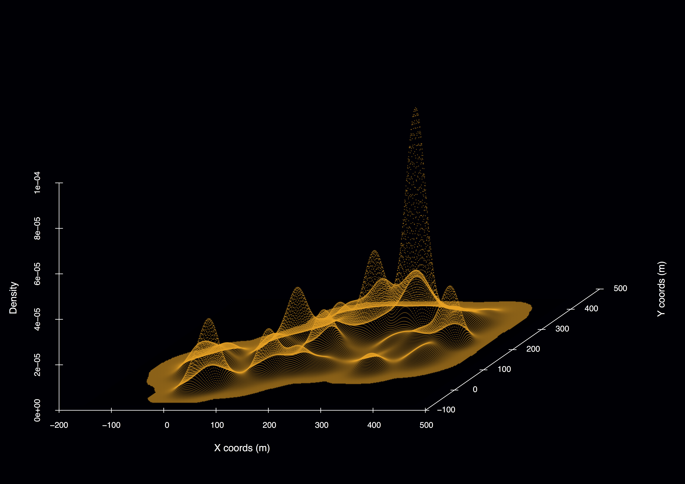

******
<!--      -->
    

******  

 
## Realtime interactive map of COVID19 coronavirus global distribution  

### People    

**Matt Malishev**     

### Tasks

* Create an interactive map of COVID19 coronavirus global distribution using live webscraped [data from the European Centre for Disease Prevention and Control (ECDC)](https://www.ecdc.europa.eu/en/geographical-distribution-2019-ncov-cases).   

### Outcomes   

[Coronavirus 2019-nCov global distribution map](https://darwinanddavis.github.io/worldmaps/coronavirus.html)  

     

### Links    

[Project page on Github.](https://github.com/darwinanddavis/worldmaps)      
  
******    

<!--  project break__________________________________________________________________________________________  -->

 
## Spatial analysis of Airbnb listings and ratings  

### People  

**Matt Malishev**       

### Tasks

* Use open online data for quick overview of Airbnb listings and ratings for chosen cities around the world.    

### Outcomes   

[Spatial overview of San Francisco Airbnb listings and ratings](https://darwinanddavis.github.io/worldmaps/airbnb_sf.html)  

    

Data: [San Francisco open Airbnb data.](http://insideairbnb.com/get-the-data.html)     
  
### Links    
  
[Project page on Github.](https://github.com/darwinanddavis/worldmaps)  

******  

<!--  project break__________________________________________________________________________________________  -->
  
 
## Simulating animal movement and dispersal potential in space and time from individual bioenergetics and geolocation data            

### Location

Centre of Excellence for Biosecurity Risk Analysis   
University of Melbourne  
Melbourne, Australia       

### People

**Matt Malishev, Centre of Excellence for Biosecurity Risk Analysis, Australia**    
Michael Kearney, University of Melbourne, Australia  
C. Michael Bull, Flinders University, Australia    
  
### Tasks

* Built a spatial and bioenergetic simulation model for animal dispersal and movement integrated with weather, microclimate, LIDAR, and geolocation data.         
* Developed a simulation framework grounded in metabolic theory of energy and mass exchange.           

### Outcomes

_Research_  

* **Malishev M**, Bull CM & Kearney MR (2018) An individual-based model of ectotherm movement integrating metabolic and microclimatic constraints. Methods in Ecology and Evolution. 9(3): 472–489, [doi:https://doi.org/10.1111/2041-210X.12909](https://besjournals.onlinelibrary.wiley.com/doi/abs/10.1111/2041-210X.12909).        

* Kearney MR, Munns SL, Moore D, **Malishev M** & Bull CM (2018) Field tests of a general ectotherm niche model show how water can limit lizard activity and distribution. Ecological Monographs. 88(4): 672–693, [https://doi.org/10.1002/ecm.1326](https://esajournals.onlinelibrary.wiley.com/doi/abs/10.1002/ecm.1326).   

* **Malishev M** & Kramer-Schadt S. Movement, models, and metabolism: Individual-based energy budgets as next- generation extensions for modelling animal movement across scales. _In review_.        

_Media_  

[British Ecological Society 2018 Robert May Prize shortlisted article](https://besjournals.onlinelibrary.wiley.com/doi/toc/10.1111/(ISSN)2041-210x.ECRAward2018).    

[Where do Animals Spend Their Time and Energy? Theory, Simulations and GPS Trackers Can Help Us Find Out](https://methodsblog.com/2019/05/22/movement-metabolism-microclimate/), Methods in Ecology and Evolution blog, May 22, 2019.  

### Example outputs  
 

  
###### Figure 1. Activity budget for 60 simulated individuals throughout the breeding season showing proportion of time spent (A) feeding, (B) searching, and (C) resting, as well as (D) proportion of number of transitions between activity states. Radius = time spent in activity state; circumference = days throughout the breeding season. Black arrows indicate a 5-day period where habitat conditions were not conducive to activity, so individuals spent this time resting in shade. Ref: Malishev et al. (2018).   
   

###### Figure 2. Movement model outputs for movement path and home ranges of (top) field geolocation data of tagged animals versus (bottom) simulated individual animals in food and refuge landscape. Active (A) and passive (B) real animals are captured by active (C) and passive (D) model simulations. (C–D) Green = food patches, black = shade patches, and polygons represent home ranges. Patch size in simulations represents time elapsed on patch. Ref: Malishev et al. (2018).  
   

###### Figure 3. (A) Distributions of home range area (km2) of real (pink) and seeded simulated active (orange) and passive (blue) movement strategies under dense resource distribution (food and shade). Home range polygons in space showing overlap of seeded simulated (B) passive and (C) active individuals and (D) real individuals. Home ranges in (D) appear more scattered due to different starting locations of real animals, whereas (B) and (C) have seeded starting locations in the centre of the landscape. The vegetation layer in (D) is generated from LIDAR data of the habitat site, showing the thermal mosaic of the landscape. Ref: Malishev et al. (2018).
   
    

###### Figure 4. Example 3D model output for simulated passive individual in a habitat of sparse resources and shade distributed in space. Density peaks represent time spent in each patch.  
   

###### Figure 5. LIDAR data of habitat site for a tagged animal in the wild showing resource and refuge patches. Polygons show changes in home range area (km2) for different months throughout the breeding season using 95% kernel densities (left) and vertices (right). Location is the Bundey Bore field station in the mid-north of South Australia (139°21’E, 33°55’S).     
   

  
###### Figure 6. LIDAR data of habitat site and GPS tracking data for all 60 individuals throughout the breeding season in (L–R) Sep, Oct, Nov, and Dec. Data show are for the 2009 season.        
     

**GPS data collection**   

All data were collected at the sleepy lizard habitat study site (139°21’E, 33°55’S) at the Bundey Bore field station in the mid-north of South Australia during the breeding season (September to December, 2009). Animal data are for the adult sleepy lizard (n = 60). Individual animals were tagged with GPS units, step counters (‘waddleometers’), and skin surface temperature probes at the beginning of the breeding season and tracked throughout the season using radio telemetry. Animals were captured and GPS data downloaded every two weeks throughout the breeding season for each individual, with batteries for the units replaced when needed. GPS units reported locations every 10 minutes, waddleometers recorded step counts every 2 minutes, and temperature probes recorded skin surface temperature every 2 minutes. The simulation model uses a 2-minute time step to correspond to the frequency of observed data.     

**NicheMapR modelling engine**  

The NicheMapR microclimate model calculates hourly estimates of solar and infrared radiation, air temperature at 1 m and 1 cm above ground level, wind velocity, relative humidity, and soil temperature at different intervals, e.g. 0 cm, 10 cm, 20 cm, 50 cm, 100 cm, and 200 cm. The model uses minimum and maximum daily air temperature, wind speed, relative humidity, soil properties (conductivity, specific heat, density, solar reflectivity, emissivity), as well as the roughness height, slope, and aspect. Climatic data are gathered from a global data set of monthly mean daily minimum and maximum air temperatures and monthly mean daily humidity and wind speeds. Soil surface temperatures are computed using heat balance equations, accounting for heat exchange via radiation, convection, conduction, and evaporation.
For simulation time steps, the microclimate model verifies the microclimate conditions for the current simulation hour of the day, e.g. noon or 18:00, and location in space, i.e. the study site for the observed animal data, and updates patches in the simulation landscape (either sun or shade) with these microenvironment conditions. As the simulated animal moves in or out of these patches at each time step, the animal updates its current T_b, including rates of change in T_b per 2-minute time step.
The onelump_varenv.R and DEB.R functions update the individual internal thermal and metabolic states, respectively. See below for both model functions.

### Links  

[Project page on Github.](https://github.com/darwinanddavis/Sleepy_IBM)      

[Supplementary Material for Malishev M, Bull, CM, and Kearney MR (2018) MEE, 9(3): 472–489](https://github.com/darwinanddavis/MalishevBullKearney).    

Kearney, M. R., and W. P. Porter. 2017. NicheMapR - an R package for biophysical modelling: the microclimate model. Ecography 40:664–674, [doi.org/10.1111/ecog.02360](https://onlinelibrary.wiley.com/doi/full/10.1111/ecog.02360).         

[NicheMapR](https://mrke.github.io/): Software suite for microclimate and mechanistic niche modelling in the R programming environment.    
   
 

<!-- ###### Header image: The [Game of Life](https://en.wikipedia.org/wiki/Conway%27s_Game_of_Life) cellular automata model, the precursor for modern individual-based models.       -->
###### Header image: Global population per city. Data source: [UN open data.](http://data.un.org/Data.aspx?d=POP&f=tableCode%3A240)     
******  

[Back to top](#top)|[Home page](./index.md)
