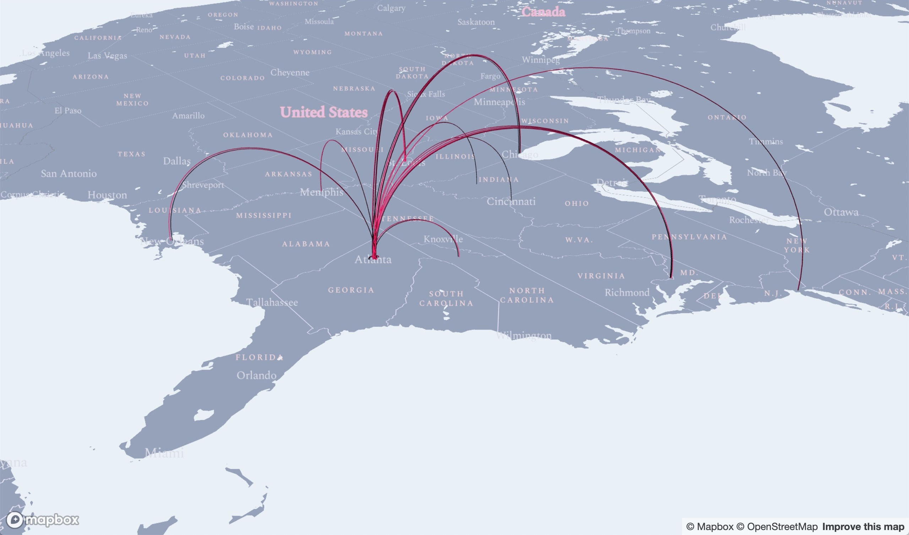
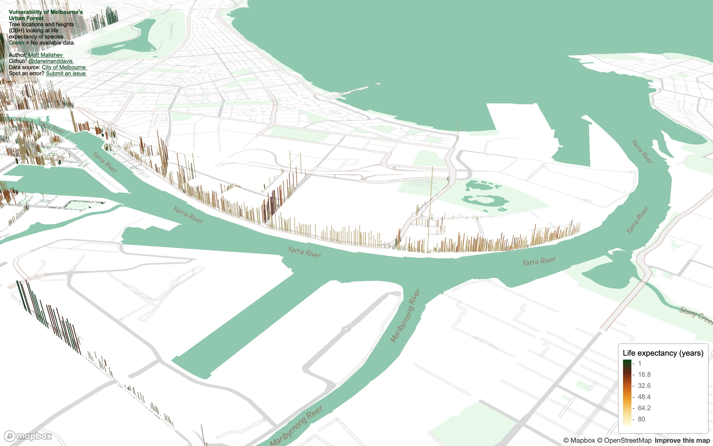
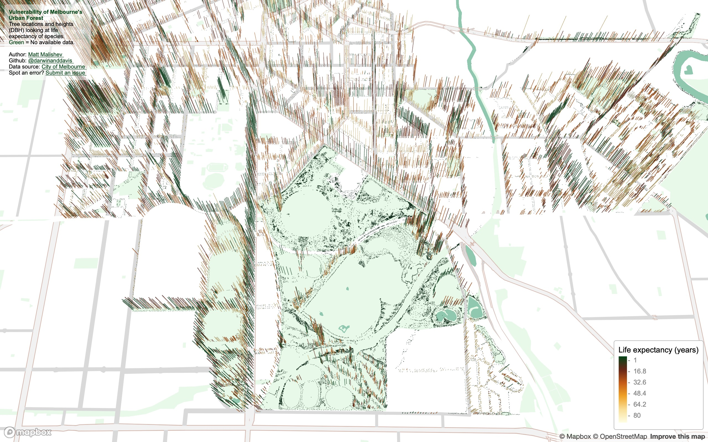
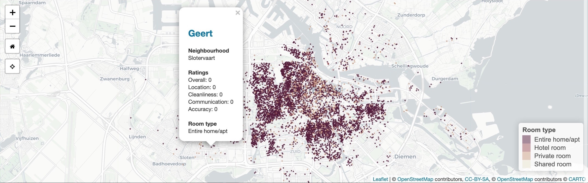
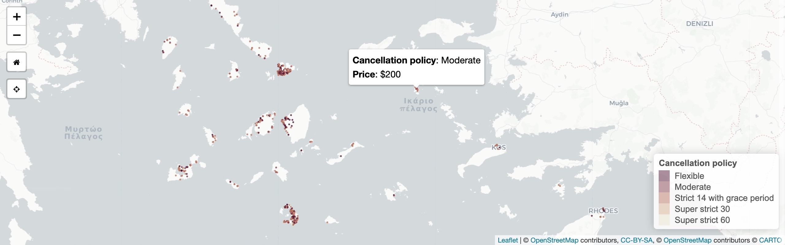
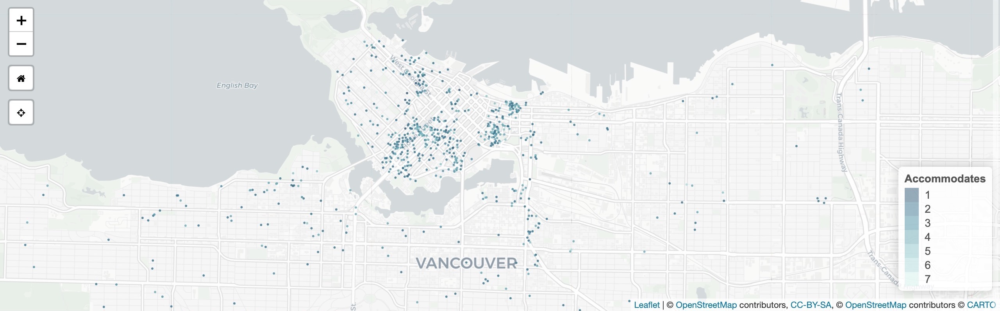
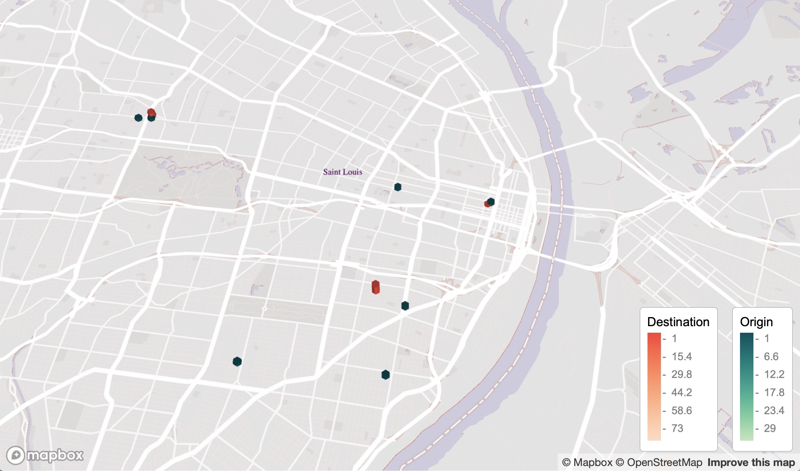

<a id="top"></a>

******    

<!--      -->
      

<br>
## Avian Airstrike: Aircraft-bird strikes across Australia (2012–2017)      

### People    

Matt Malishev       

### Tasks  

* Integrate open data with R and Mapbox  
* Wrangle data for deeper analysis using tricontour plot and hexbin heatmap  

<center>
    
</center>    

### Tools   

R    
Mapbox    
HTML  
CSS  
  
### Links      
[`R` code](https://github.com/darwinanddavis/worldmaps/tree/gh-pages/docs/30daymap2021)   

******     

<!--  project break__________________________________________________________________________________________  -->

<br>
## Where do Melburnians eat? Exploring restaurant seating capacity per area        


<div align="center"; text-align:center>
    
</div>  

### People    

Matt Malishev       

### Tasks  

* Map open data from the City of Melbourne data portal on human recreational hotspots  
* Build and integrate Mapbox Studio map design      

### Tools        

R  
Mapbox  
HTML
CSS  
```{r}    
pacman::p_load(here,mapdeck,dplyr,ggmap,sp,maptools,scales,rgdal,ggplot2,jsonlite,readr,devtools,colorspace,mapdata,ggsn,mapview,mapproj,ggthemes,reshape2,grid,rnaturalearth,rnaturalearthdata,purrr)          
```  
    
### Links      
[`R` code](https://github.com/darwinanddavis/worldmaps/tree/gh-pages/docs/30daymap2021)   

******       

<!--  project break__________________________________________________________________________________________  -->

<br>
## Classifying major ecoregions in Brazil        

<div align="center"; text-align:center>
    
</div>  

### People    

Matt Malishev       

### Tasks  

* Analysis Natural Earth data to classify major biodiversity ecosystems in Brazil  
* Apply new map projection to sf and raster data    

### Tools          

R    
```{r}    
pacman::p_load(here,mapdeck,dplyr,ggmap,sp,maptools,scales,rgdal,ggplot2,jsonlite,readr,devtools,colorspace,mapdata,ggsn,mapview,mapproj,ggthemes,reshape2,grid,rnaturalearth,rnaturalearthdata,ggtext,purrr)          
```  
    
### Links      
[`R` code](https://github.com/darwinanddavis/worldmaps/tree/gh-pages/docs/30daymap2021)   

******     

<!--  project break__________________________________________________________________________________________  -->

<br>  
## The Human Lifeline        

<div align="center"; text-align:center>
    
</div>  

### Tools   

R       
```{r}    
pacman::p_load(here,mapdeck,dplyr,ggmap,sp,maptools,scales,rgdal,ggplot2,readr,devtools,colorspace,mapdata,ggsn,mapview,mapproj,ggthemes,rnaturalearth,rnaturalearthdata,ggtext)          
```  
    
### Links        
[`R` code](https://github.com/darwinanddavis/worldmaps/tree/gh-pages/docs/30daymap2021)     

******     

<!--  project break__________________________________________________________________________________________  -->

<br>
## Visualising the vulnerability of Melbourne’s urban forest  

### People    

Matt Malishev       

### Tasks  

* Map location, traits, species, and density of tree canopy coverage in the city of Melbourne      
* Build and integrate the map design from Mapbox Studio  
* As always, use open data and learn a new tool      

I found some comprehensive data on tree canopy coverage in Melbourne from 2019 on the [City of Melbourne Open Data](https://data.melbourne.vic.gov.au/) site and tree traits are always fun to plot in 3D.    

The data cover species, genera, height (DBH), life expectancy, latlons, year and date planted, precinct location, to name a few. I plotted tree locations and height to show some spatial patterns, e.g. you can see where tall trees have been cleared in areas that are known to have high rise apartments buildings. I added life expectancy as the colour factor to get a snapshot idea of planting activity by the city council and choice of species over time. Lots more to explore.             

Some interesting things to explore:      
* How often do invulnerable species need to be re-planted?    
* What kinds of vegetation remains by 2050 if nothing new is planted?       
* What species are least vulnerable to attack (disease, climate, pollution) and are these species prioritised in future urban planning?     

### Outcomes      

Zoom and tilt (hold CMD/CTRL) around the map to explore hotspots for given trees based on height and age. Press the down arrow or use the up/down webpage scroll bar if the legend is chopped off.        

### [Click for full map](https://darwinanddavis.github.io/worldmaps/30daymap2020/day11)  
(Best viewed in Safari and full screen)     
     
             

### Process  

First, load the necessary packages in `R` and read in the data from the web 

```r
pacman::p_load(here,mapdeck,dplyr,purrr,readr,showtext,stringr,colorspace,htmltools)
url <- "https://data.melbourne.vic.gov.au/api/views/fp38-wiyy/rows.csv?accessType=DOWNLOAD"
tree <- url %>% read_csv()
tree %>% rename(DBH = `Diameter Breast Height`,
                Expectancy = `Useful Life Expectency Value`,
                Lon = Longitude,
                Lat = Latitude,
                Species = `Common Name`) -> tree
# data 
tree$Expectancy[is.na(tree$Expectancy)] <- 0 # available data 

```

Build the stylistic components for the map design 

```r
# get font 
newfonts <- "Fonts/BREVE2.ttf"
fontlib <- "breve"
font_add(fontlib,regular = newfonts,bold = newfonts)
showtext_auto(enable = T) # auto showtext

# style
my_style <- "mapbox://styles/darwinanddavis/ckhe7nocp0euc19oeehfy713s" # style  
my_style_public <- "https://api.mapbox.com/styles/v1/darwinanddavis/ckhe7nocp0euc19oeehfy713s.html?fresh=true&title=copy&access_token="
ttl <- "Life expectancy (years)"  
colv <- paste0(c("#004616",sequential_hcl(5,"YlOrBr")),"B3")
colvl <- colv[1] # link col

```

Then create the titles, subtitles, and legends

```r
main <- data.frame("Y"=tree$Lat %>% min + 0.005,"X"=tree$Lon %>% max + 0.0005,
                   "title"= paste0("Vulnerability of\nMelbourne's\nUrban Forest"))

main2 <- data.frame("Y"=tree$Lat %>% min + 0.02,"X"=tree$Lon %>% max + 0.01,
                   "title"= paste0("No. of trees: ", tree %>% nrow() %>% format(big.mark=",",scientific = F,trim = T),"\n",
                                   "Tree species: ", tree %>% pull(Species) %>% str_to_title() %>% unique %>% length,"\n",
                                   "Avg lifespan: ", tree %>% summarise(Expectancy %>% mean) %>% pull %>% plyr::round_any(1)," years"))

title_text <- list(title = 
                     paste0("<strong style=color:#004616;>Vulnerability of Melbourne's<br> Urban Forest</strong> <br/>
                            Tree locations and heights <br> (DBH) looking at life <br> expectancy of species. <br>
                            <span style=color:#004616;>Green </span> = No available data. <br> <br>
                            Author: <a style=color:",colvl,"; href=https://darwinanddavis.github.io/DataPortfolio/> Matt Malishev </a> <br/>
                            Github: <a style=color:",colvl,"; href=https://github.com/darwinanddavis/worldmaps/tree/gh-pages> @darwinanddavis </a> <br/>
                            Data source: <a style=color:",colvl,"; href=https://data.melbourne.vic.gov.au/> City of Melbourne </a> <br/>
                            Map style: <a style=color:",colvl,"; href=", my_style_public,"MAPBOX_ACCESS_TOKEN> Mapbox </a> <br/>
                            Spot an error? <a style=color:",colvl,"; href=https://github.com/darwinanddavis/worldmaps/issues> Submit an issue </a> <br/>"),
                   css = "font-size: 10px; background-color: rgba(255,255,255,0.5);"
                     )

```

Finally, build the map by reading in the dataset, loading the map style from Mapbox, and adding the font and titles  

```r
# map 
zoom <- 20
pitch <- 60
bearing <- -30

mp11 <- mapdeck(
  location = c(tree$Lon %>% median,tree$Lat %>% median),
  zoom = zoom, 
  pitch = pitch, bearing = bearing,
  min_zoom = zoom, max_zoom = zoom,
  min_pitch = pitch, max_pitch = pitch,
  style = my_style
) %>%
  add_grid(data = tree, lat = "Lat", lon = "Lon", 
           elevation = "DBH", elevation_scale = 1,
           elevation_function = "max",
           colour_function = "max",
           colour = "Expectancy",
           layer_id = "tree",
           extruded = T, cell_size = 3,
           update_view = F, focus_layer = T,
           legend = T, #mll,
           legend_options = list(title = ttl),
           colour_range = colv) %>% 
  add_text(data=main,lat = "Y", lon = "X", 
           text = "title", layer_id = "m1",
           alignment_baseline = "top",anchor = "start",
           fill_colour = colv[1], angle = 82,
           billboard = F,update_view = F,
           font_weight = "bold",
           font_family = "Avenir"
           ) %>% 
  add_title(title = title_text,layer_id = "heading")
mp11

```

Save the map locally, then commit the changes to git and push to Github  

```r
mp11 %>% htmlwidgets::saveWidget(here::here("worldmaps","30daymap2020","day11.html")) # saved without heading 

```  

### Snapshot analysis     

SW of city, facing NE. The Central Business District (CBD, centre grid), showing low canopy and short-lived vegetation. The central downtown probably aims for seasonal, high turnover species to match the rapid development pace of the area. 

   
<br>

West of city, facing SE. Low canopy or young long-lived species lining the Docklands, the major port area of the city, which also has high-rise apartment buildings.     

   
<br>

North of city, facing SSE. Royal Park remains open and free of tall species. The larger, open green space is Melbourne Zoo and the National State and Hockey Centre. The bottom right pocket dominated by low canopy or young long-lived species may be due to the type of soil or bedrock adjacent to Moonee Ponds Creek.   

   
<br>

North of city, facing south (aerial view). Tree density and location hugs Melbourne's city grid structure.   

       
<br>  

NE of city, facing south. The highest density of the tallest (diameter at breast height, DBH) trees in the city. The large, open green spaces to the left is Melbourne/Olympic Park, Yarra Park, and AAMI Park, which house the five major state sports ovals.        

       
<br>  
  
### Tools     
  
R             
Mapbox  
HTML    
CSS    
```{r}    
pacman::p_load(here,mapdeck,dplyr,purrr,readr,showtext,stringr,colorspace,htmltools)  
```  
    
### Links            
[`R` code](https://github.com/darwinanddavis/worldmaps/tree/gh-pages/docs/30daymap2020)        


### Data      
[City of Melbourne Open Data](https://data.melbourne.vic.gov.au/)    

<!--  project break__________________________________________________________________________________________  -->

******  

<br>
<a id="airbnb"></a>  
[](#airbnb)  
## Mapping and analysing Airbnb’s global property listings      

### People    

Matt Malishev    

### Tasks

* Build a web app with RShiny that maps property listings from open Airbnb data based on user experience categories    
* Build a UI that compares property criteria among cities around the world              
* Create an automated script that updates listings with newly available data     

Inside Airbnb has open Airbnb listing data for cities around the world. The datasets contain latlon location, listing details, urls to the listing on Airbnb, price, bedrooms, ratings for multiple categories, such as cleanliness and communication, plus a suite of criteria based on what users may seek when looking for booking a listing.       

My aim was to create a web app that mimics that Airbnb site, but uses data analysis to map available listings to comapre cities around the world based on user criteria rather than simply listing price and availability.         
  
The criteria users can select to compare among cities  

* Bed type    
* Room type    
* Property type  
* Bathrooms       
* Cancellation policy  
* Reviews per month  
* Review scores rating  
* Security deposit  
* Cleaning fee   
* Accommodates (no. of people)     

For example, you can choose a city, set a price range, set number of bedrooms, then choose to map available listings based on cancellation policy. The app will plot listing locations, profile ID, rating info, and links to the listing on Airbnb based on the chosen criteria. You can then keep the criteria and choose another city to directly compare listings between the cities based on cancellation policy.  

### [Launch Shiny app](https://darwinanddavis.shinyapps.io/airbnb/)          

Example of the user interface that shows criteria to plot and compare. Users can select criteria, such as Property type, then switch between cities around the world to compare prices, location, and ratings of available listings.     

                 

<br>    

**Example outputs**  
  
Amsterdam, Netherlands. Room type, 1 bedroom, $100–$600 p/n  
             
<br>  

South Angean Islands, Greece. Cancellation policy, 1 bedroom, $200–$500 p/n    
             
<br>  

Vancouver, Canada. Accommodates, 1 bedroom, $150–$1000 p/n    
             
<br>  

Barcelona, Spain    
             
<br>  

Copenhagen, Denmark  
             
<br>  

Geneva, Switzerland  
             
<br>  

Istanbul, Turkey  
             
<br>  
  
### Tools     
  
R
Shiny               
Leaflet  
HTML  
CSS  
```{r}    
pacman::p_load(shiny,shinythemes,dplyr,here,leaflet,rgdal,sp,sf,raster,colorspace,mapdata,ggmap,jpeg)  
```  
    
### Links            
[`R` code](https://github.com/darwinanddavis/worldmaps/tree/gh-pages/docs/shiny/airbnb)          

### Data  
[Inside Airbnb](http://insideairbnb.com/get-the-data.html) open data    
   
<!--  project break__________________________________________________________________________________________  -->

******     

<br>  
## 70 years of Russian refugee resettlement         

### People    

Matt Malishev       

### Tasks  

* Map global emigration pathways to show patterns in space and time  
* Use animated arcs to capture data visually in Mapbox    

I found these human migration data online from the [UN Refugee Agency](https://data.world/unhcr) and being close to my own Russian heritage, I wanted to see what patterns in Russian refugee and emigration numbers emerged over the decades. The data span 1950 to 2017. The original dataset is broken up into individual years, but it looked super messy when I first mapped it, so I instead collapsed the data into decades to create a neater design.    

Notes    
* Width of lines = decade of migration scaled relatively from 1950s to 2010s    
* Frequency of line movement = proxy for the quantity (number of refugees)   
* Hover over the lines to view the refugee migration numbers for that country 
* Zoom and tilt (hold CMD/CTRL) around the map to explore   

### Outcomes    

### [Click for full interactive map](https://darwinanddavis.github.io/worldmaps/30daymap2020/day23)  
(Best viewed in Safari and full screen)         
     
             
<br>  

             
<br>  

             
<br>  

             
<br>  
  
### Process  
 
Full code found in the link below.   

Load packages and data     
```r
# pkgs 
pacman::p_load(here,dplyr,rworldmap,mapdeck,sf,sfheaders,data.table,readr,rgeos,purrr,stringr,ggthemes,showtext,geosphere,htmlwidgets)

# data 
rus <- "https://query.data.world/s/5mx46siuiq62l6y4m6che6ute47iys" %>% read_csv(trim_ws = T,skip = 1)
rus <- rus %>% select(c(1,3,4)) %>% 
  rename("Country" = 1,"Year" = 2,"Number" = 3) %>% 
  mutate_at(vars(Number), funs(as.numeric(Number))) # convert to num
rus <- rus[complete.cases(rus),]
```

After getting latlon coords for destinations, collapse the time component into decades    
```r
# summarise df
rusdf <- rusdf %>% mutate_at(vars(Year), funs(
  case_when(Year %>% str_detect("195") ~ 1950, # collapse years 
            Year %>% str_detect("196") ~ 1960,
            Year %>% str_detect("197") ~ 1970,
            Year %>% str_detect("198") ~ 1980,
            Year %>% str_detect("199") ~ 1990,
            Year %>% str_detect("200") ~ 2000,
            Year %>% str_detect("201") ~ 2010
  ))) %>% 
  group_by(Country,Year,Lon,Lat,oLon,oLat) %>% # create new df
  summarise_at(vars(Number), funs(Number %>% sum)) %>% # get summed n
  arrange(Year) 
```

Define the map variables to show visually. 
* Width of lines = decade of migration scaled relatively from 1950 to 2010      
* Frequency of line movement = proxy for the quantity (number of refugees)     

```r
# add map vars to df
v1 <- "Country" # var for colvec 
v2 <- "Year" # var for stroke 
colv <- sequential_hcl(rusdf[,v1] %>% unique %>% lengths,"Burg")
stroke <- seq_along(rusdf[,v2] %>% unique %>% unlist)
cc <- data.frame(colv,rusdf[,v1] %>% unique) # create unique dfs 
ss <- data.frame(stroke,rusdf[,v2] %>% unique)
colnames(cc) <- c("Colour",v1)
colnames(ss) <- c("Stroke",v2)
rusdf <- merge(rusdf,cc,by=v1) # match colours to cc
rusdf <- merge(rusdf,ss,by=v2) # match stroke to ss
height <- rusdf$Stroke/10 # stagger height
freq <- rusdf$Number/500 # lag
```

Create Mapbox style elements and build map

```r
my_style <- "mapbox://styles/darwinanddavis/ckhxh9u580u8819noa3ucl3q1" # style  
my_style_public <- "https://api.mapbox.com/styles/v1/darwinanddavis/ckhxh9u580u8819noa3ucl3q1.html?fresh=true&title=copy&access_token="
ttl <- paste("70 years of\nRussian refugee\nresettlement") 
subttl <- paste0("___________________ \n",
                 "Width = Decade \n  ",
                 "Frequency = No. of refugees \n")
dttl <- "UN Refugee Agency" 
durl <- "https://data.world/unhcr"
colvl <- colv[1] # link col

# map
mapdeck(
  location = c(rusdf$Lon[1],rusdf$Lat[1]),
  zoom = zoom,
  style = my_style
) %>% 
  add_animated_arc(data = rusdf,
                   layer_id = "year",
                   origin = c("oLon","oLat"),
                   destination = c("Lon","Lat"),
                   stroke_from = "Colour",
                   stroke_to = "Colour",
                   stroke_width = "Stroke",
                   frequency = "Freq",
                   height = "Height",
                   animation_speed = s,
                   trail_length = tl,
                   tilt = ti,
                   update_view = F, focus_layer = T,
                   auto_highlight = T,
                   highlight_colour = "#000000E6",
                   tooltip = "Label",
                   legend = F
  ) %>% add_text(data=main,lat = "Y", lon = "X",
                 text = "title", layer_id = "m1",
                 alignment_baseline = "top",anchor = "start",
                 fill_colour = colvl,
                 size = "size", # angle = "angle",
                 billboard = F,update_view = F,
                 font_weight = "bold",
                 font_family = family
  ) %>%
  add_text(data=main2,lat = "Y", lon = "X",
           text = "title", layer_id = "m2",
           alignment_baseline = "top",anchor = "start",
           fill_colour = colvl,
           size = "size", #angle = "angle",
           billboard = F,update_view = F,
           font_family = family
  ) %>%
  add_title(title = title_text,layer_id = "heading") %>% 
  htmlwidgets::saveWidget(here::here("worldmaps","30daymap2020","day23.html"))

```

### Tools     
  
R             
Mapbox  
```r 
pacman::p_load(here,dplyr,rworldmap,mapdeck,sf,sfheaders,data.table,readr,rgeos,purrr,stringr,ggthemes,showtext,geosphere,htmlwidgets)
```  
    
### Links            
[`R` code](https://github.com/darwinanddavis/worldmaps/tree/gh-pages/docs/30daymap2020)        

### Data  
[UN Refugee Agency](https://data.world/unhcr)    

******    

<!--  project break__________________________________________________________________________________________  -->

<br>  
## Mapping Lyft ride activity from passenger user data    

### People    

Matt Malishev      

### Tasks     

* Map rideshare user activity over two years  
* Build and integrate the map design from Mapbox Studio         

Using geolocation data for my Lyft rides as a passenger to build an interactive map that shows my Lyft user activity, including origin pickup and destination dropoff points. The data cover the USA.  

These data are really cool, so I just wanted to make use of them. Hexagons are good for visualising frequency and mobility spatial data. My data here ended up being too coarse (obviously I didn't take enough Lyft rides) to leverage this, but it tells a story about where my ride activity is weighted. There is also a time component, which I'll definitely use for another analysis.                 

### Outcomes  

Zoom out to see the cities where I used Lyft to get around. Cities with labels contain data, sometimes only a few points.     

### [Click for full map](https://darwinanddavis.github.io/worldmaps/30daymap2020/day4)        
(Best viewed in Safari and full screen)        

Atlanta, USA (where I lived during this time)      
 
<br>

### Process  

* Data were obtained from my Lyft ride report.    
* Data were first georeferenced to get geolocations.       
* Hexagons are good for large scale coarse and clustered data, like heatmaps. The data here are too sparse to make full use of this.    
* There is a higher density of destination sites because I primarily used Lyft to get home, which is concentrated on one latlon point.   
* Georeferencing the data didn't find all locations, so some points are missing.              

Load packages and read in data       
```r
require(pacman)
p_load(mapdeck,readr,ggmap,dplyr,sf,sfheaders,data.table,tigris,sp,maps,colorspace)

# read data 
od <- paste0("https://github.com/darwinanddavis/worldmaps/blob/gh-pages/data/day4_od.Rda?raw=true") %>% url %>% readRDS
dd <- paste0("https://github.com/darwinanddavis/worldmaps/blob/gh-pages/data/day4_dd.Rda?raw=true") %>% url %>% readRDS

```

Load geodata and polygon shapefiles for USA  
```r  
# labels 
latlon_data <- with(world.cities, data.frame( # //maps
  "city" = name,"country" = country.etc,"lat" = lat,"lon" = long,"population" = pop)
)
city_labels <- c("San Francisco","Memphis","New Orleans","Saint Louis","Chicago","Atlanta","Asheville","Raleigh","Washington","New York")
city_text <- latlon_data %>% filter(country == "USA" & city %in% city_labels ) %>% select(city,lat,lon)

```

Add title and credentials for map interface    
```r
title_text <- list(title = 
              "<strong>Mapping Lyft ride data</strong> <br/>
              Author: <a href=https://darwinanddavis.github.io/DataPortfolio/> Matt Malishev </a> <br/>
               Github: <a href=https://github.com/darwinanddavis/worldmaps> @darwinanddavis </a> <br/>
               Spot an error? <a href=https://github.com/darwinanddavis/worldmaps/issues> Submit an issue </a> <br/>" ,
              css = "font-size: 8px; background-color: rgba(255,255,255,0.5);"
)
```

Build the map by reading in the dataset, loading the map style from Mapbox, and adding the font and titles.      
```r
# map 
my_style <- "mapbox://styles/darwinanddavis/ckh4kmfdn0u6z19otyhapiui3" # style  
mp4 <- mapdeck(
  location = c(od$lon[1],od$lat[1]), 
  zoom = 10,
  pitch =  30,
  style = my_style
) %>%
  add_hexagon(data = dd, lat = "lat", lon = "lon", 
              radius = 100,
              digits = 3,
              elevation = "lat",
              elevation_scale = 15,
              elevation_function = "sum",
              layer_id = "dest",
              legend = T, update_view = F,
              legend_options = list(title="Destination"),
              auto_highlight = T, highlight_colour = "#FFFFFFFF",
              colour_range = colorspace::sequential_hcl(6,"OrYel")) %>%
  add_hexagon(data = od, lat = "lat", lon = "lon", 
              radius = 100,
              digits = 3,
              elevation = "lat",
              elevation_scale = 5, 
              elevation_function = "sum",
              layer_id = "origin",
              legend = T, update_view = F,
              legend_options = list(title="Origin"),
              auto_highlight = T, highlight_colour = "#FFFFFFFF",
              colour_range = colorspace::sequential_hcl(6,"Purp")) %>% 
  add_text(data=city_text,lon = "lon", lat = "lat",
           layer_id = "label", text = "city",
           alignment_baseline = "top",anchor = "end",
           fill_colour = "black",
           billboard = T,update_view = F,
           font_family = "Lato Regular",
           size=15
  ) %>% 
  add_title(title = title_text, layer_id = "title")
mp4
mp4 %>% saveWidget(here::here("worldmaps","30daymap2020","day4.html"))  


```
  
Washington DC, USA     
 
<br>  

St Louis, USA  
 
<br>  

Chicago, USA  
 
<br>  
  
### Tools     
  
R    
Mapbox  
HTML  
CSS           
```{r}  
pacman::p_load(mapdeck,readr,ggmap,dplyr,sf,sfheaders,data.table,tigris,sp,maps,colorspace)  
```  
              
### Links      
[`R` code](https://github.com/darwinanddavis/worldmaps/tree/gh-pages/docs/30daymap2020)    

******    

<!--  project break__________________________________________________________________________________________  -->

<br>
## Mapping user geolocation and points of interest from user mobile data      

### People    

Matt Malishev     

### Tasks  

* Map geolocation and point of interest (POI) from user mobile data     
* Integrate custom font and popup features in Mapbox  
* Build and integrate the map design from Mapbox Studio       

An interactive map of my favourite places and POI from my mobile data. Part of a larger project where I'm mapping my favourite food places around the world to create a centralised repository so I can more easily address the following conversation:      

> Friend: 'Do you know any good _INSERT FOOD_ places in _INSERT CITY_?'          
> Me: 'Sure thing, I collated all my favourite places and put it all in this site. Enjoy.'                  

This map shows my favourite coffee places around the world.   

### Outcomes  

### [Click for full map](https://darwinanddavis.github.io/worldmaps/30daymap2020/day1)   
(Best viewed in Safari and full screen)            
  
      

### Process 

* Data were georeferenced from mobile location data using Open Street Map        
* Map designed in Mapbox Studio      

Load packages and data  
```r
# pcks 
require(pacman)
p_load(mapdeck,readr,purrr,stringr,dplyr,tibble,htmltools,sf,sfheaders,data.table,stringr,tigris,sp,here,htmlwidgets)

# read in current data
id_df <- "https://raw.githubusercontent.com/darwinanddavis/worldmaps/gh-pages/data/id_df.csv" %>% read_csv
```

Select user-defined category to map  
```r
fh <- "coffee"
m <- paste0("https://github.com/darwinanddavis/worldmaps/blob/gh-pages/data/",fh,".Rda?raw=true") %>% url %>% readRDS
m$name <- m$name %>% paste0("\n \n \n") # add linebreaks to names
m_ttl <- tibble(lon=-43,lat=31, # add title
                name=paste0(fh %>% stringr::str_to_upper(),"\nSNACKMAP")
)
```

Create style elements for map  
```r  
# labels 
family <- "Chalkboard"
colv <- "#E1B69B"

style <- list( # css label style 
  "font-weight" = "normal",
  "padding" = "8px",
  "color" = colv
)

point_label <- paste0( # add label tooltip  
  "<div style=\"color:",style$color,"; padding:",style$padding,"; font-family:",family,";\">
  <b>",m$name,"<b><br><br>
  <b>Address: <b><br>", m$address %>% str_to_upper(),"<br><br> 
  <b>Type: <b><br>", m$type %>% str_to_upper() %>% str_replace_all("_"," "), 
  "</div>") %>% map(htmltools::HTML)

m$label <- point_label # add css text tooltip to df
```

Build map using dataset and add geolocation data as a tooltip       
```r
# map 
mp <- mapdeck(data=m,
        location = c(m$lon[1],m$lat[1]), 
        zoom = 2,
        pitch =  0,
        style = id_df %>% filter(Name == fh) %>% pull(Style)
) %>%
  add_pointcloud(lon = "lon",lat = "lat", 
                 layer_id = "latlon",id = "latlon",
                 fill_colour = id_df %>% filter(Name == fh) %>% pull(Col),
                 auto_highlight = T, 
                 highlight_colour = paste0(colv,"00"),
                 elevation = 0,
                 radius = 10, 
                 update_view = F,
                 tooltip = "label"
  ) %>% 
  mapdeck::add_text(lon = "lon", lat = "lat", # location names 
                    layer_id = "label", text = "name",
                    alignment_baseline = "top",anchor = "end",
                    fill_colour = id_df %>% filter(Name == fh) %>% pull(Col),
                    billboard = T,update_view = F,
                    font_family = family,
                    size=15
  ) %>% 
  mapdeck::add_text(m_ttl,lon = "lon", lat = "lat", # title
                    layer_id = "title", text = "name",
                    alignment_baseline = "top",anchor = "end",
                    fill_colour = id_df %>% filter(Name == fh) %>% pull(Col),
                    billboard = F, update_view = F,
                    font_family = family, font_weight = "bold",
                    size=35
  )
mp
mp %>% htmlwidgets::saveWidget(here::here("worldmaps","30daymap2020","day1.html"))  
```                       

Bucharest, Romania    
 
<br>  

New York City, USA  
 
<br>  

New Orleans, USA  
 
<br>    

Atlanta, USA  
 
<br>  

St Louis, USA  
 
<br>  

### Tools     
  
R    
Mapbox     
HTML  
CSS        
```{r}  
pacman::p_load(mapdeck,readr,ggmap,dplyr,sf,sfheaders,data.table,tigris,sp,maps,colorspace)  
```  
              
### Links      
[`R` code](https://github.com/darwinanddavis/worldmaps/tree/gh-pages/docs/30daymap2020)    

******  

<!--  project break__________________________________________________________________________________________  -->

<br>
## The spatial range of Australia’s wild camel population  

### People    

Matt Malishev     

### Tasks

* Map online open data of large geographic dispersal limits of an animal population     
* Use Mapbox's screengrid function to plot density and range limits         

Did you know Australia has camels? Millions of feral ones, roaming the deserts like big, roaming, feral camels. There are so many camels, the data almost blew up my laptop trying to map them. Here are some fun facts about Australia's feral camels:    

* Largest global population of feral, dromedary (one-humped) camels  
* 3.3 million km<sup>2</sup> total dispersal range (about 40% of rural Australia)    
* About 0.5–2 camels / km<sup>2</sup>       
* First introduced in 1840, so that's a long time for camels to settle    
* Compounded annual growth at an enviable 8% pa over the last 70 years      

AKA the Great Feral Camel Crater of Australia  

I found these data online from [Northern Territory's Department of the Environment and Natural Resources](https://data.gov.au/data/dataset/9e807c7f-bc64-47ea-a1f2-87a4609ea69c) and the original research paper from Saalfeld & Edwards (2010).   
  
These data are from aerial observations and the boundary line is expected dispersal (old data, so they're probably in your backyard by now). Low density (magenta) represents approx. 0.25 camels, high density (white) represents ~2 camels. Lots of camels.           

### [Click for full map](https://raw.githubusercontent.com/darwinanddavis/worldmaps/gh-pages/img/day20.jpg)          
     
             
<br>  
  
### Tools     
  
R             
Mapbox  
HTML  
CSS  
```{r}    
pacman::p_load(dplyr,here,mapdeck,rgdal,sp,sf,raster,colorspace,mapdata,ggmap,jpeg)  
```  
    
### Links            
[`R` code](https://github.com/darwinanddavis/worldmaps/tree/gh-pages/docs/30daymap2020)        

### Data  
Department of the Environment and Natural Resources – Northern Territory of Australia.    
Saalfeld W. K., Edwards G. P. (2010) Distribution and abundance of the feral camel (_Camelus dromedarius_) in Australia. The Rangeland Journal 32, 1-9, [https://doi.org/10.1071/RJ09058](https://www-publish-csiro-au.eu1.proxy.openathens.net/RJ/RJ09058)  

   
******     

<!--  project break__________________________________________________________________________________________  -->


<br>
## 30 Day Map Challenge for November 2020     

### People    

Matt Malishev

### Tasks  

An excuse to dive into the vault of maps I never bothered to post at the time of making them, as well as test some new concepts and perhaps tools. There's always more to map, so this is a good opportunity and show some of the cool things I like to create in the spatial world.               

### Outcomes  

### [Check out the #30DayMapChallenge 2020 page](./30daymapchallenge.md) for my entries.              

                


******      

<!--  project break__________________________________________________________________________________________  -->


<br>
## Realtime interactive map of COVID19 coronavirus global distribution  

### People    

Matt Malishev     

### Tasks

* Create an interactive map of COVID19 coronavirus global distribution using live webscraped [data from the European Centre for Disease Prevention and Control (ECDC)](https://www.ecdc.europa.eu/en/geographical-distribution-2019-ncov-cases).   

### Outcomes   

### [Click for full map](https://darwinanddavis.github.io/worldmaps/coronavirus.html)              

       

Global cases (plus cases ranked)   
             
<br>  

Global deaths (plus deaths ranked)   
             
<br>  
  
Global cases in last 15 days     
             
<br>  

### Links    

[Project page on Github.](https://github.com/darwinanddavis/worldmaps)      
  
******    

<!--  project break__________________________________________________________________________________________  -->

<br>
## Spatial analysis of Airbnb listings and ratings  

### People  

Matt Malishev        

### Tasks

* Use open online data for quick overview of Airbnb listings and ratings for chosen cities around the world.    

### Outcomes   

[Spatial overview of San Francisco Airbnb listings and ratings](https://darwinanddavis.github.io/worldmaps/airbnb_sf.html)  

    

Data: [San Francisco open Airbnb data.](http://insideairbnb.com/get-the-data.html)     
  
### Links    
  
[Project page on Github.](https://github.com/darwinanddavis/worldmaps)  

******  

<!--  project break__________________________________________________________________________________________  -->
  
<br>
## Building simulation models to forecast species dispersal potential from environment, climate, and movement data                

### Location

Centre of Excellence for Biosecurity Risk Analysis       
Melbourne, Australia       

### People

**Matt Malishev, Centre of Excellence for Biosecurity Risk Analysis, Australia**    
Michael Kearney, University of Melbourne, Australia  
C. Michael Bull, Flinders University, Australia    
  
### Tasks

* Built a spatial and bioenergetic simulation model for animal dispersal and movement integrated with weather, microclimate, LIDAR, and geolocation data.         
* Developed a simulation framework grounded in metabolic theory of energy and mass exchange.           
 
### Outcomes

_Research_  

* **Malishev M**, Bull CM & Kearney MR (2018) An individual-based model of ectotherm movement integrating metabolic and microclimatic constraints. Methods in Ecology and Evolution. 9(3): 472–489, [doi:https://doi.org/10.1111/2041-210X.12909](https://besjournals.onlinelibrary.wiley.com/doi/abs/10.1111/2041-210X.12909).        

* Kearney MR, Munns SL, Moore D, **Malishev M** & Bull CM (2018) Field tests of a general ectotherm niche model show how water can limit lizard activity and distribution. Ecological Monographs. 88(4): 672–693, [https://doi.org/10.1002/ecm.1326](https://esajournals.onlinelibrary.wiley.com/doi/abs/10.1002/ecm.1326).   

* **Malishev M** & Kramer-Schadt S. Movement, models, and metabolism: Individual-based energy budgets as next- generation extensions for modelling animal movement across scales. _In review_.        

_Media_  

[British Ecological Society 2018 Robert May Prize](https://besjournals.onlinelibrary.wiley.com/doi/toc/10.1111/(ISSN)2041-210x.ECRAward2018) shortlisted article.      

Where do Animals Spend Their Time and Energy? Theory, Simulations and GPS Trackers Can Help Us Find Out, [Methods in Ecology and Evolution blog](https://methodsblog.com/2019/05/22/movement-metabolism-microclimate/), May 22, 2019.  

### Example outputs  
<br>

  
###### Figure 1. Activity budget for 60 simulated individuals throughout the breeding season showing proportion of time spent (A) feeding, (B) searching, and (C) resting, as well as (D) proportion of number of transitions between activity states. Radius = time spent in activity state; circumference = days throughout the breeding season. Black arrows indicate a 5-day period where habitat conditions were not conducive to activity, so individuals spent this time resting in shade. Ref: Malishev et al. (2018).   
<br>  


###### Figure 2. Movement model outputs for movement path and home ranges of (top) field geolocation data of tagged animals versus (bottom) simulated individual animals in food and refuge landscape. Active (A) and passive (B) real animals are captured by active (C) and passive (D) model simulations. (C–D) Green = food patches, black = shade patches, and polygons represent home ranges. Patch size in simulations represents time elapsed on patch. Ref: Malishev et al. (2018).  
<br>  


###### Figure 3. (A) Distributions of home range area (km2) of real (pink) and seeded simulated active (orange) and passive (blue) movement strategies under dense resource distribution (food and shade). Home range polygons in space showing overlap of seeded simulated (B) passive and (C) active individuals and (D) real individuals. Home ranges in (D) appear more scattered due to different starting locations of real animals, whereas (B) and (C) have seeded starting locations in the centre of the landscape. The vegetation layer in (D) is generated from LIDAR data of the habitat site, showing the thermal mosaic of the landscape. Ref: Malishev et al. (2018).
<br>  
    

###### Figure 4. Example 3D model output for simulated passive individual in a habitat of sparse resources and shade distributed in space. Density peaks represent time spent in each patch.  
<br>  


###### Figure 5. LIDAR data of habitat site for a tagged animal in the wild showing resource and refuge patches. Polygons show changes in home range area (km2) for different months throughout the breeding season using 95% kernel densities (left) and vertices (right). Location is the Bundey Bore field station in the mid-north of South Australia (139°21’E, 33°55’S).     
<br>  

  
###### Figure 6. LIDAR data of habitat site and GPS tracking data for all 60 individuals throughout the breeding season in (L–R) Sep, Oct, Nov, and Dec. Data show are for the 2009 season.        
<br>    

    
      
###### Figure 7. Simulated (green) and real (blue) data of disperal potential of model agent and animal in space (easting and northin) and time (density). Z-axis represents the time spent in each model landscape or habitat patch.     
<br>  

        
###### Figure 8. Average rate of body temperature change (ºC) against average body temperature (ºC) of simulated large mass (left) and small mass (right) individuals. A) High dispersal and B) low dispersal ability in space with high habitat resource density and C) high dispersal and D) low dispersal ability in space with low resource density Vertical dashed blue, orange, and red lines represent transition, lower activity range, and upper activity range temperatures, respectively.  
<br>    

**GPS/telemetry data collection**     

All data were collected at the habitat study site (139°21’E, 33°55’S) at the Bundey Bore field station in the mid-north of South Australia (September to December, 2009). Individual-level data (n = 60) are from tagged individuals with GPS units, step counters, and skin surface temperature probes at the beginning of the season and tracked throughout the season using radio telemetry. Individuals were captured and GPS data downloaded every two weeks throughout the season, with batteries for the units replaced when needed. GPS units reported locations every 10 minutes, step counters recorded step counts every 2 minutes, and temperature probes recorded skin surface temperature every 2 minutes. The simulation model uses a 2-minute time step to correspond to the frequency of observed data.     

**`NicheMapR` microclimate modelling engine**  

The NicheMapR microclimate model calculates hourly estimates of solar and infrared radiation, air temperature at 1 m and 1 cm above ground level, wind velocity, relative humidity, and soil temperature at different intervals, e.g. 0 cm, 10 cm, 20 cm, 50 cm, 100 cm, and 200 cm. The model uses minimum and maximum daily gridded air temperature, wind speed, relative humidity, soil properties (conductivity, specific heat, density, solar reflectivity, emissivity), as well as roughness height, slope, and aspect. Climatic data are gathered from a global data set of monthly mean daily minimum and maximum air temperatures and monthly mean daily humidity and wind speeds. Soil surface temperatures are computed using heat balance equations, accounting for heat exchange via radiation, convection, conduction, and evaporation.
For simulation time steps, the microclimate model verifies the microclimate conditions for the current simulation hour of the day, e.g. noon or 18:00, and location in space, i.e. the study site for the observed geolocation/telemetry data, and updates patches in the simulation landscape (either sun or shade) with these microenvironment conditions. As the simulated agents move in or out of these patches at each time step, the agent updates its current internal parameters for each time step, i.e. rates of change in body temperature per 2-minute time step.  
The `onelump_varenv.R` and `DEB.R` functions update the individual internal thermal and metabolic states, respectively.  

******      
  
<br>

### Links     

[Project page on Github.](https://github.com/darwinanddavis/Sleepy_IBM)      

[Supplementary Material for Malishev M, Bull, CM, and Kearney MR (2018) MEE, 9(3): 472–489](https://github.com/darwinanddavis/MalishevBullKearney).    

Kearney, M. R., and W. P. Porter. 2017. NicheMapR - an R package for biophysical modelling: the microclimate model. Ecography 40:664–674, [doi.org/10.1111/ecog.02360](https://onlinelibrary.wiley.com/doi/full/10.1111/ecog.02360).         

[NicheMapR](https://mrke.github.io/): Software suite for microclimate and mechanistic niche modelling in the R programming environment.    
<br>  
<br>

<!-- ###### Header image: The [Game of Life](https://en.wikipedia.org/wiki/Conway%27s_Game_of_Life) cellular automata model, the precursor for modern individual-based models.       -->
###### Header image: Global population per city. Data source: [UN open data.](http://data.un.org/Data.aspx?d=POP&f=tableCode%3A240)     
******  

[Back to top](#top)|[Home page](./index.md)
