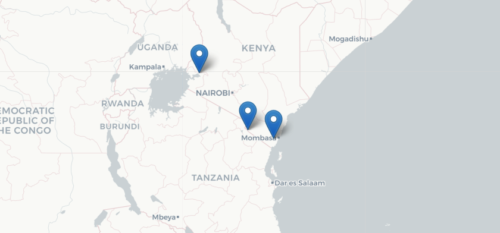

<a id="top"></a>

******  


<br>
## Time series analysis of field temperature data and human disturbance events in human schistosome hotspots            

### Location  

Emory University  
Atlanta, USA  

### People  

Seul Lee, Emory University, USA       
**Matt Malishev, Emory University, USA**    
Martina Laidemitt, NIH Fogarty International Center, USA  
David Civitello, Emory University, USA      

### Tasks   

* Integrate environmental data with time series analysis (wavelet transformation) to show how human disturbance translates to increased disease exposure risk  


### Outcomes    

* Lee S, **Malishev M**, Laidemitt M & Civitello DJ (2019) Time series analysis of field temperature data identifies human-induced change to snail host habitats producing human schistosomes (poster), Graduate Student Symposium, Emory University.      

### Example outputs 

**Methods for wavelet analysis of time series data**  

Pseudocode for running wavelet 
```
input parameters for wavelet function
analysis function
   [ site location
     time horizon ]
execute function
   [ read and clean temperature data
     set time horizon
     run wavelet analysis
     plot outputs ]
```
<br>

Wavelet analysis `R` code

<!-- ________________________________________  code chunk ________________________________________  -->
```r
packages <- c("WaveletComp","viridis")
if(require(packages)){install.packages(packages,dependencies = T)}
ppp <- lapply(packages,require,character.only=T)
if(any(ppp==F)){cbind(packages,ppp)
cat("\n\n\n ---> Check packages are loaded properly <--- \n\n\n")}

graphics.off()
par(las=1,bty="n",col=adjustcolor("steelblue",alpha=0.5))
# ---------------------------- constant/variable time period 
# when dt = 0.25, lower.period must equal 4 because lower period is 1/dt    
# X axis = time in temperature data
# Y axis = deconstructed time period (periodicity), e.g. days, weeks, month 

periodicity <- "constant" # constant or variable
# input data (an equal start and end period = constant time, i.e no change in periodicity)
start.period <- 1
dt <- # 4 =  
end.period <- 100
len <- 100 # length of time series
lowerPeriod <- 16 # lower period range (t) (16 (2^4) to 128 (2^7))
upperPeriod <- 128
djv <- 250 # number of octaves to determine the resolution along the period axis
ifelse(periodicity=="constant",end.period <- start.period, end.period <- end.period)

set.seed(12)
x <- periodic.series(1,100,100)
x <-periodic.series(start.period = start.period, 
	end.period = end.period, 
	length = len);x
# x <- x + 0.2*rnorm(1000) # add some noise 
par(mar=c(1,1,1,1))
plot(x,type="l")
my.data <- data.frame(x)
myw <- analyze.wavelet(my.data,"x",
                        loess.span = 0, # detrend time series
                        dt = dt, # define time limit (1 = 1/dt)
                        dj = 1/djv, # resolution (octave/suboctave)
                        lowerPeriod = lowerPeriod, # define time period
                        upperPeriod = upperPeriod,
                        make.pval = T, # show p vals
                        n.sim = 10 # region of significant periods
                        )

# plot wavelet analysis attributes
par(mfrow=c(1,2))
# period range on log scale (determined by dj)
plot(myw$Period,type="l",main="Log period range") 
# linear model against real part of complex values in Wave 
plot(myw$Wave,pch=".",col=adjustcolor("orange",0.5),main="Complex conjugate") 

# plot wavelet analysis
require(viridis)
require(sp)
n.levels <- 200 # number of levels for colour palette
colv <- sort(inferno(n.levels,0.1,0.9),decreasing=T)
par(mfrow=c(1,1))
wt.image(myw,
         color.key = "interval", # quantile
         plot.contour = F,
         plot.ridge = F,
         n.levels = n.levels, # colour levels
         color.palette = "colv",
         useRaster = T, # use raster or polygons
         legend.params = list(lab="Wavelet power levels",mar=5),
         label.time.axis = F,
         timelab = "Time",
         # date.tz = "", # timezone for dates. "" = local time
         # show.date = T,
         # date.format = "%Y-%m-%d" # format for calendar dates
         plot.coi = F
         )
```  
<!-- ________________________________________ end code chunk ________________________________________  -->
<br>

Other areas to apply this analysis:  

* Seasonal infection spikes    
* Physiological reaction to drugs   
* Chemical spectral analysis  
* Geothermal activity/earthquake spikes  
* Decay rates of minerals/chemicals  
  
<br>       

Code for spatial location data  

<!-- ________________________________________  code chunk ________________________________________  -->
```r
# packages
pacman::p_load(leaflet,dplyr)

# load data. can also be generated from google api. 
site_names <- c("Kisumu","Lake Jipe","Kinango")
kisumu <- c(-0.0917,34.7680)
lake_jipe <- c(-3.6019,37.7557)
kinango <- c(-4.1393,39.3180)
latlon <- t(data.frame(kisumu,lake_jipe,kinango))
colnames(latlon) <- c("lat", "lng") # need to be named this
latlon

# build map ---------------------------------------------------------------
### default maps
require(leaflet)
map <- leaflet() # initiate the leaflet map object
map <- addTiles(map) # add the actual map tiles to the leaflet object

names(providers) # types of base maps available
# some good custom layers
# 37-48, 97-103, 
# provider_type <- names(providers)[37]
provider_type <- "CartoDB.Positron"# set the above input as the custom base
col_site <- "red" # colour of site marker
radius <- 10 # size of site marker
zoom <- 6 # zoom level
opac <- 1 # transparency of map elements
weight <- 2 # width of poly lines

map <- addMarkers(map, 
                  lng = latlon[,"lng"],
                  lat = latlon[,"lat"],
                  data=latlon)

# add custom map bases 
map <- addProviderTiles(map, provider_type,
	options = providerTileOptions(opacity = opac) # add opacity to country lines
)
# plot
map
```
<!-- ________________________________________ end code chunk ________________________________________  -->
<br>

  
###### Figure 1. Site locations for temperature probe data and known sites for schistosomiasis exposure.       
<br>  

  
  
        
###### Figure 2. Field temperature fluctuations and wavelet power spectrums over time in human exposure sites to schistosomiasis in Kimorigo Swamp, Tanzania (top), Powerhouse site, Kenya (middle), and Kinango Dam, Kenya (bottom). Horizontal lines in left plots indicate the optimal body temperature (14C−26C) for _Biomphalaria_ hosts for transmitting the disease. Wavelet analyses show the time horizon (periods of days, weeks, months) over time of year (data collection period). Power levels indicate periodicity strength of temperatures in right plots.    
<br>  

[Download the full poster (`.png`) (large file: 19.5 Mb).](https://github.com/darwinanddavis/SchistoIBM/raw/master/wavelet/lee_etal_poster.png)  
<br> 

  
###### Figure 3. Snippet of the 'Time series analysis of field temperature data identifies human-induced change to snail host habitats producing human schistosomes' research poster.     

<br>  
<br>  

###### Header image: A 3D simulation model output of cell residence times of a mobile agent in a 1500 x 1500 grid as external constraints to spatial dispersal relax over time. Output is projected on a 2D plane to illustrate an almost linear pattern in displacement.    
******  

[Back to top](#top)|[Home page](./index.md)

